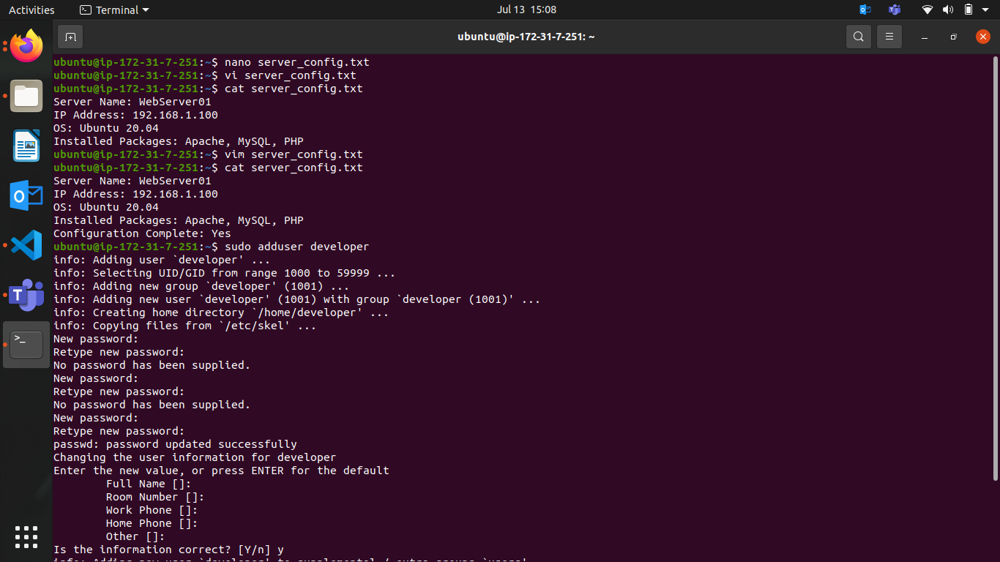
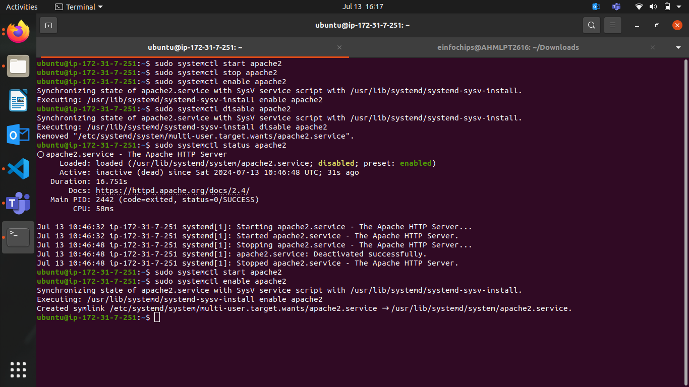
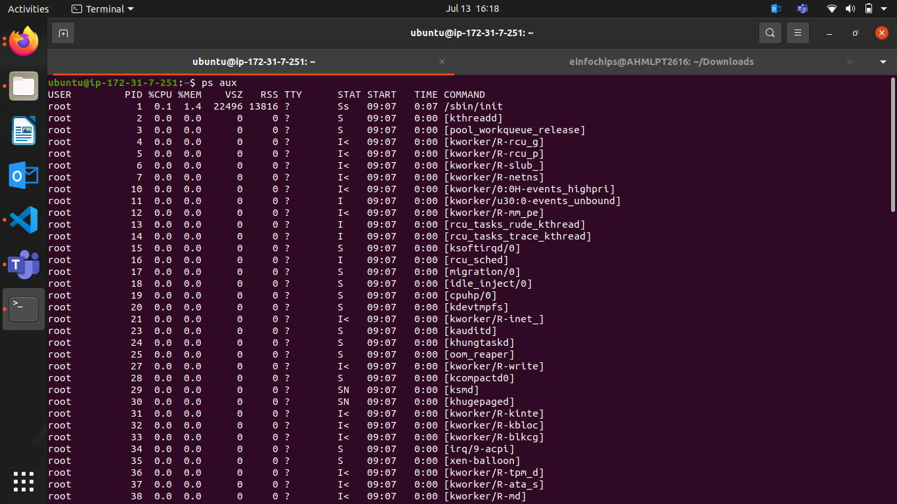
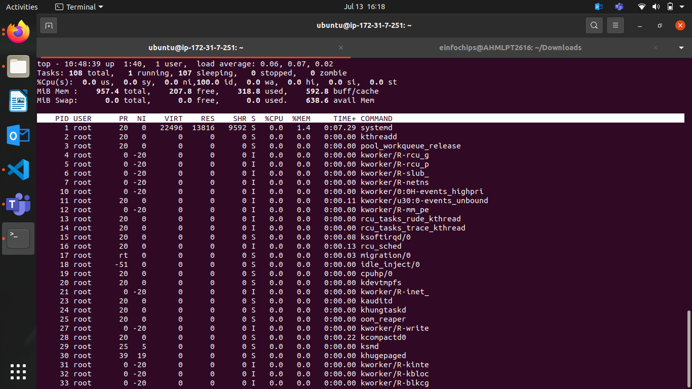
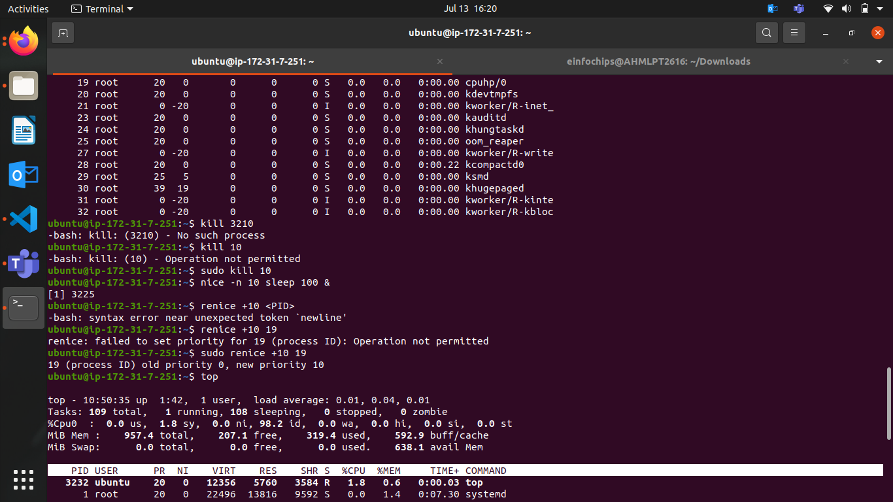
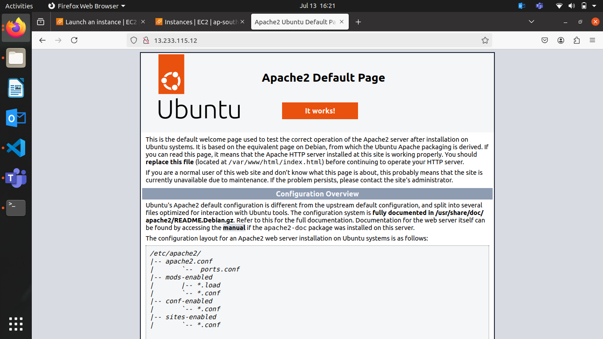
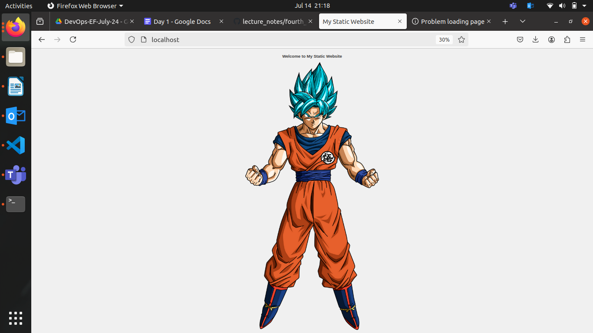

# Project Overview

###### This project spans various aspects of Linux system administration, including file management, user and group management, service control, process handling, and more. You will be completing tasks that simulate real-world scenarios, providing hands-on experience with Linux commands and configurations.

### Project Breakdown
--- Creating and Editing Text Files
Scenario: You are tasked with documenting the configurations and settings for a new server.

#### Using Nano
Create a file server_config.txt using Nano:
```bash
nano server_config.txt
```

Add the following content:
```
Server Name: WebServer01

IP Address: 192.168.1.100

OS: Ubuntu 20.04
```

Save and exit (Ctrl+O, Enter, Ctrl+X).

#### Using Vi
Edit the same file with Vi:
```bash
vi server_config.txt
```

Append the following text:

> Installed Packages: Apache, MySQL, PHP


+ **Save and exit (Esc, :wq).**

#### Using Vim
Further edit the file with Vim:
```bash
vim server_config.txt
```

Add the following text:

> Configuration Complete: Yes

Save and exit (Esc, :wq).


#### User & Group Management 

##### Adding/Removing Users
##### Add a new user developer:
```bash
sudo adduser developer
```
***

##### Remove the user developer:
```bash
sudo deluser developer
```
***

##### Managing Groups

Create a group devteam:
```bash
sudo groupadd devteam
```
***


##### Add the user developer to the devteam group:
```bash
sudo usermod -aG devteam developer
```

Here -aG refers that to add user developer to devteam group while keeping their existing group membership intact
***

##### Remove the user developer from the devteam group:
```bash
sudo gpasswd -d developer devteam
```
***

#### File Permissions Management

##### View permissions for server_config.txt:
```bash
ls -l server_config.txt
```
***

##### Changing Permissions and Ownership
###### Change permissions to read/write for the owner and read-only for others:
```bash
chmod 644 server_config.txt
```
***

##### Verify the change:
```bash
ls -l server_config.txt
```
***

##### Change the owner to developer and the group to devteam:
```bash
sudo chown developer:devteam server_config.txt
```
***

##### Verify the change:
```bash
ls -l server_config.txt
```
***

#### Controlling Services and Daemons 

##### Managing Services with systemctl
##### Start the Apache service:
```bash
sudo systemctl start apache2
```
***

##### Stop the Apache service:
```bash
sudo systemctl stop apache2
```
***

##### Enable the Apache service to start on boot:
```bash
sudo systemctl enable apache2
```
***

##### Disable the Apache service:
```bash
sudo systemctl disable apache2
```
***

##### Check the status of the Apache service:
```bash
sudo systemctl status apache2
```
***

### Understanding Daemons
Discuss the role of the sshd daemon in providing SSH access to the server.
#### Process Handling

##### List all running processes:
```bash
ps aux
```
***

##### Use top to view processes in real-time:
```bash
top
```
***

##### Managing Processes

Identify a process to kill using ps or top, then kill it:
```bash
kill <PID>
```
***

##### Change the priority of a process (e.g., running sleep with a lower priority):
```bash
nice -n 10 sleep 100 &
```

##### Change the priority of the process using renice:
```bash
renice +10 <PID>
```
***

### Creating and Deploying a Static Website with Apache2

##### Installing Apache2 

Update Package Lists

Open the terminal and run:
```bash
sudo apt update
```

Install Apache2

Install Apache2 by running:
```bash
sudo apt install apache2
```

Start and Enable Apache2

Start the Apache2 service:
```bash
sudo systemctl start apache2
```

Enable Apache2 to start on boot:
```bash
sudo systemctl enable apache2
```

Verify Installation
Open a web browser and navigate to http://your_server_ip, if we are running on instance. We can see the Apache2 default page.
***

#### Creating the Website 
Navigate to the Web Directory

Change to the web root directory:
```bash
cd /var/www/html
```

Create a New Directory for the Website

Create a directory named mystaticwebsite:
```bash
sudo mkdir mystaticwebsite
```

Change ownership of the directory:
```bash
sudo chown -R $USER:$USER /var/www/html/mystaticwebsite
```

Create HTML File

Create and edit the index.html file:
```bash
nano /var/www/html/mystaticwebsite/index.html
```

Add the following content:
```html
<!DOCTYPE html>
<html>
<head>
  <title>My Static Website</title>
  <link rel="stylesheet" type="text/css" href="styles.css">
</head>
<body>
  <h1>Welcome to My Static Website</h1>
  <p>This is a simple static website using Apache2.</p>
  <script src="script.js"></script>
</body>
</html>
```

Save and exit (Ctrl+O, Enter, Ctrl+X).

Create CSS File

Create and edit the styles.css file:
```bash
nano /var/www/html/mystaticwebsite/styles.css
```

Add the following content:
```CSS
body {
  font-family: Arial, sans-serif;
  background-color: #f0f0f0;
  text-align: center;
  margin: 0;
  padding: 20px;
}

h1 {
  color: #333;
}
```

Save and exit (Ctrl+O, Enter, Ctrl+X).

Create JavaScript File

Create and edit the script.js file:
```bash
nano /var/www/html/mystaticwebsite/script.js
```

Add the following content:
```js
document.addEventListener('DOMContentLoaded', function() {
  console.log('Hello, World!');
});
```

Save and exit (Ctrl+O, Enter, Ctrl+X).

Add an Image

Download or copy an image file (e.g., logo.png) to the website directory:
```bash
cp /path/to/your/logo.png /var/www/html/mystaticwebsite/logo.png
```

Update index.html to include the image:
```html
<body>
  <h1>Welcome to My Static Website</h1>
  
  <p>This is a simple static website using Apache2.</p>
  <script src="script.js"></script>
</body>
```
***

### Configuring Apache2 to Serve the Website

Create a Virtual Host File

Create and edit the virtual host configuration file:
```bash
sudo nano /etc/apache2/sites-available/mystaticwebsite.conf
```

Add the following content:
```
<VirtualHost *:80>
  ServerAdmin webmaster@localhost
  DocumentRoot /var/www/html/mystaticwebsite
  ErrorLog ${APACHE_LOG_DIR}/error.log
  CustomLog ${APACHE_LOG_DIR}/access.log combined
</VirtualHost>
```

Save and exit (Ctrl+O, Enter, Ctrl+X).

Enable the New Virtual Host

Enable the virtual host configuration:
```bash
sudo a2ensite mystaticwebsite.conf
```

Disable the Default Site

Disable the default site configuration:
```bash
sudo a2dissite 000-default.conf
```

Reload the Apache2 service to apply the changes:
```bash
sudo systemctl reload apache2
```
***

#### Test the Configuration

Open a web browser and navigate to http://your_server_ip. We can see the static website with the HTML, CSS, JS, and image.


