## Day 11 Task

##### Project Overview - Create a private git repo that has a maven project. In Jenkins create 2 freestyle project, one to compile that maven project and other to test that maven project. Create a pipeline view of the project.

##### Step1. Create a github private repo

Creating a repository
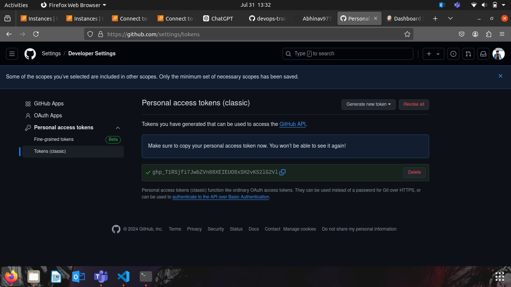

Generating the personal token
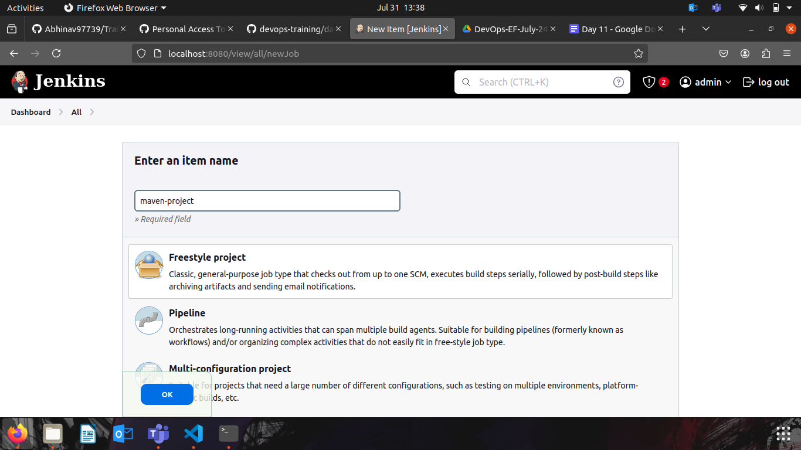

#### Step2. Compiling the maven project

Create a new freestyle project
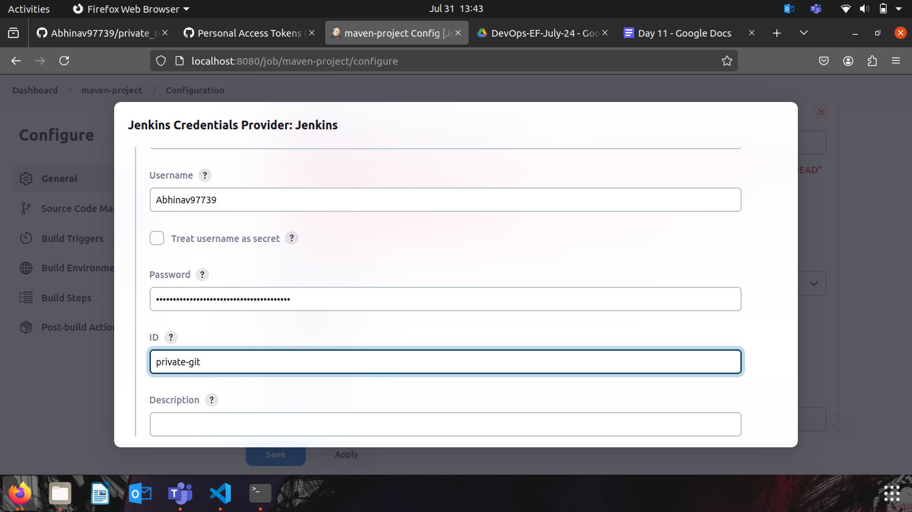

Setting the git credentials in jenkins
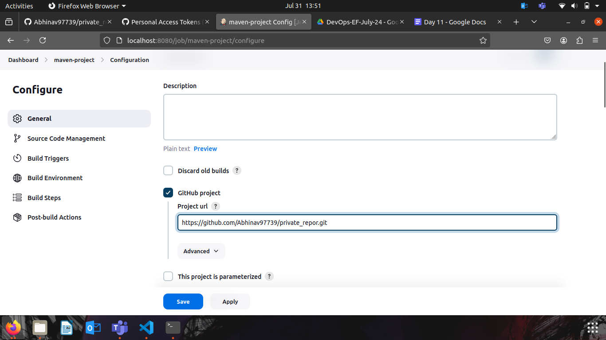

Configure the freestyle project according to the need 
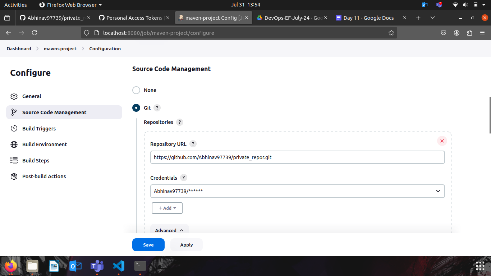
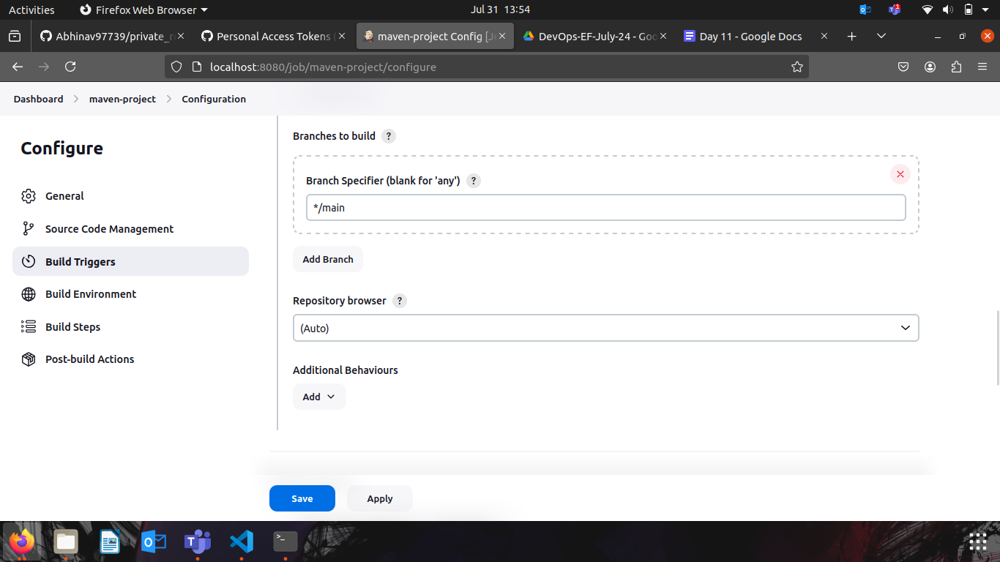
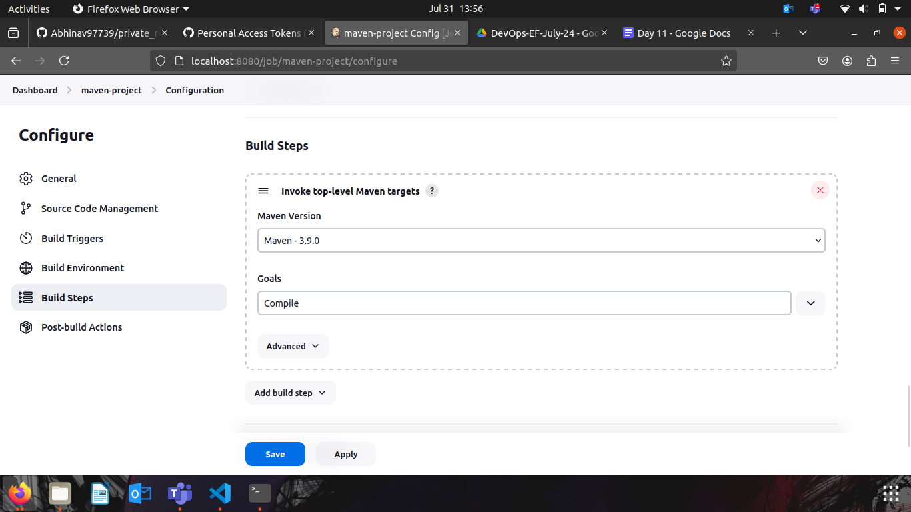
Setup the maven installation
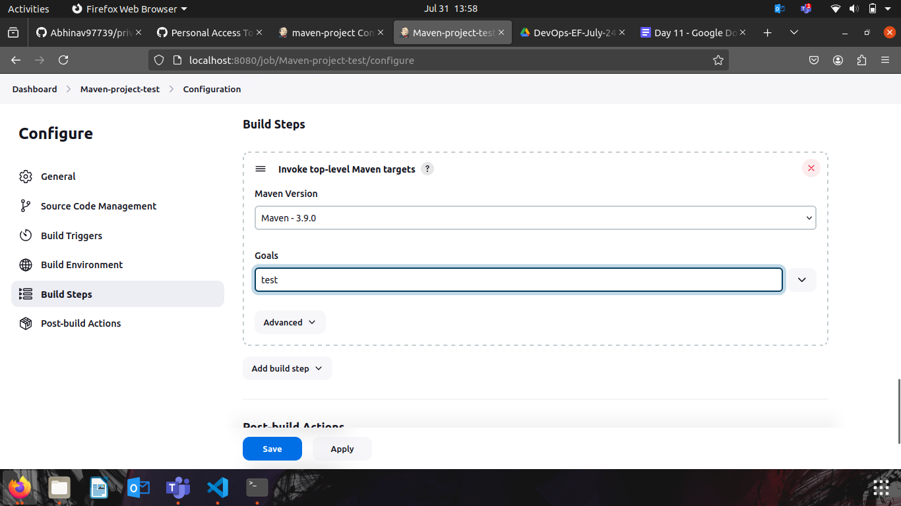
Setting the maven build steps compile

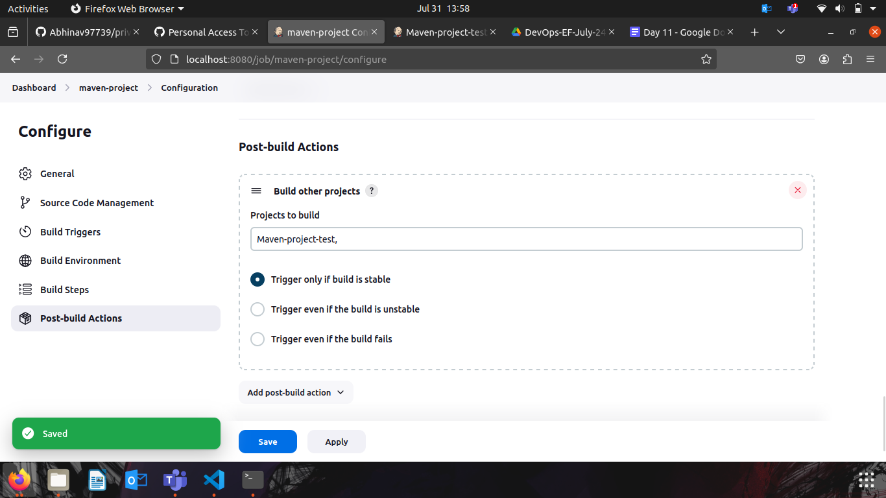

Building tha  maven project-compile 
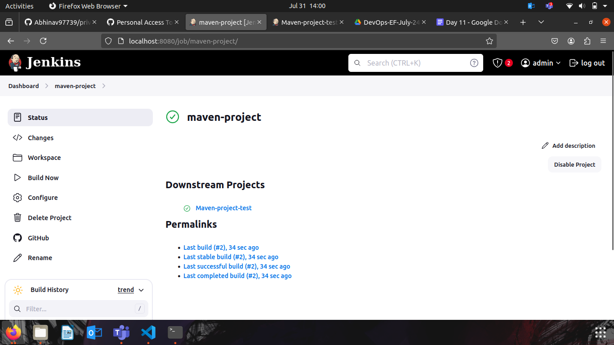

Testing the maven project 
- Create another freestyle and configure it
- Setup maven build and test
- Build the project
- Adding the post build action and creating a new build pipeline 
- Fill the details 

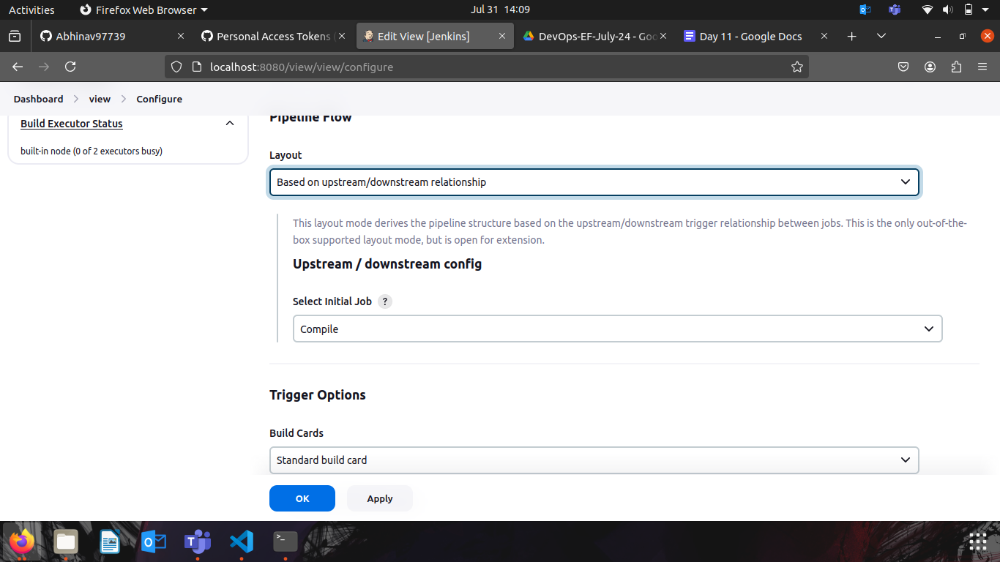
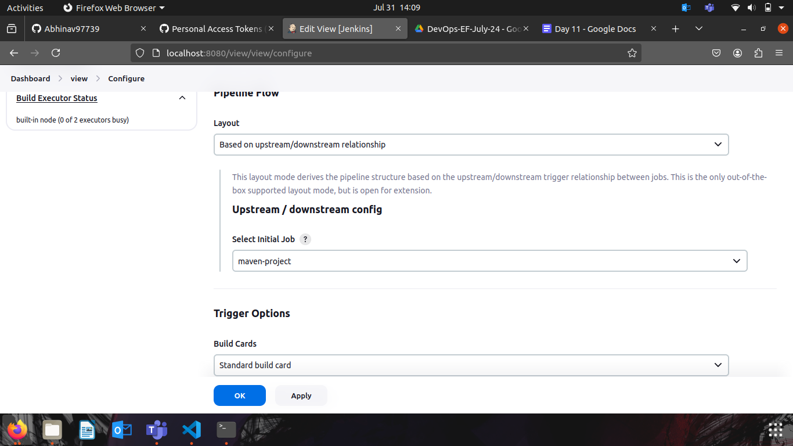
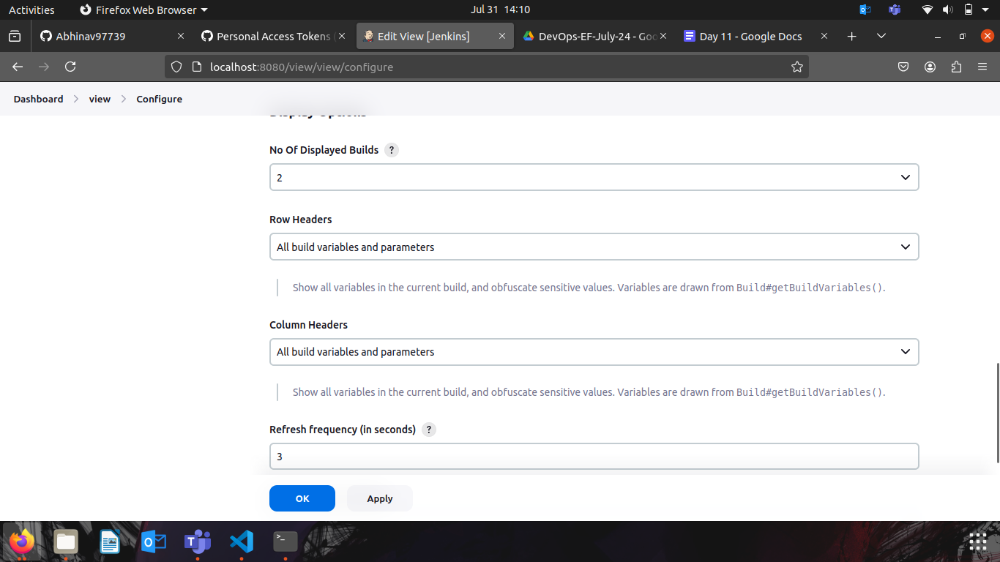

Final Output
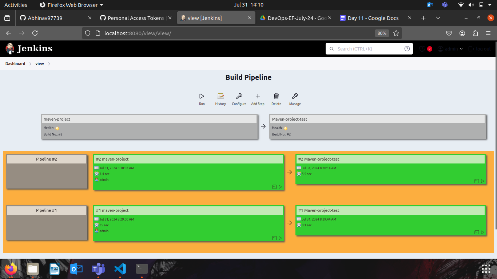