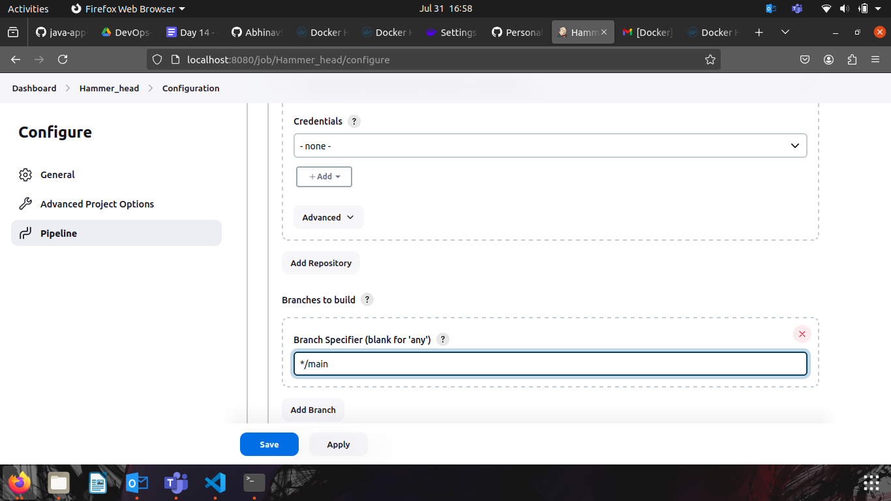
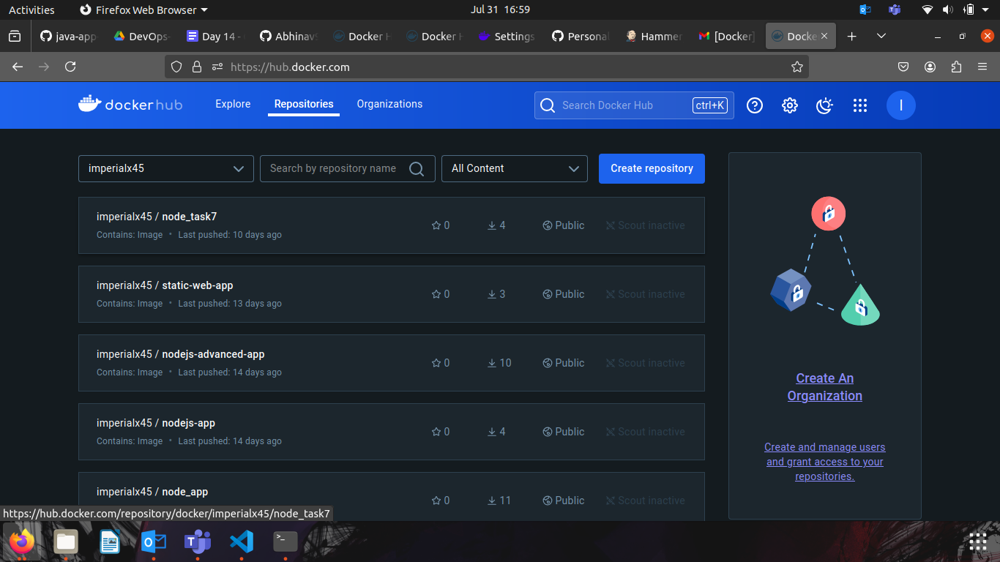
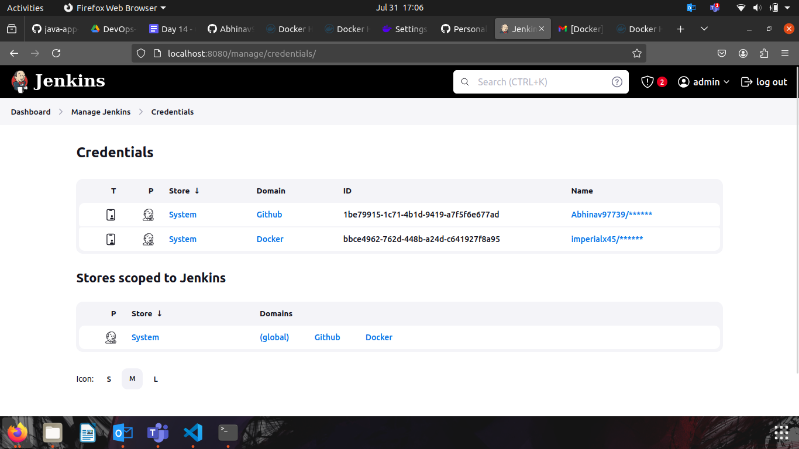
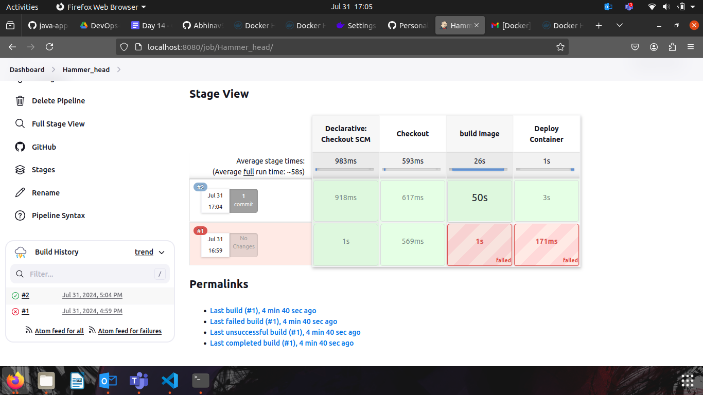

## Project 01

#### You are tasked with setting up a CI/CD pipeline using Jenkins to streamline the deployment process of a simple Java application. The pipeline should accomplish the following tasks:

1. Fetch the Dockerfile: 
The pipeline should clone a GitHub repository containing the source code of the Java application and a Dockerfile.

2. Create a Docker Image: 
The pipeline should build a Docker image from the fetched Dockerfile.

3 Push the Docker Image: 
The pipeline should push the created Docker image to a specified DockerHub repository.

4. Deploy the Container: The pipeline should deploy a container using the pushed Docker image.

Pushes the Docker image to DockerHub.

Deploys a container using the pushed image.
DockerHub Repository: A DockerHub repository where the Docker images will be stored.

Jenkins Setup:
Jenkins installed and configured on a local Ubuntu machine.

Required plugins installed (e.g., Git, Docker, Pipeline).

