## Day:-16
### Project:-1 
### Deliverables:
1. Control Node Setup:
    - Install Ansible on the control node.
    - Configure SSH key-based authentication   between the control node and managed nodes
2. Managed Nodes Configuration:
    - Ensure all managed nodes are properly configured to be controlled by Ansible.
    - Verify connectivity and proper setup between the control node and managed nodes.
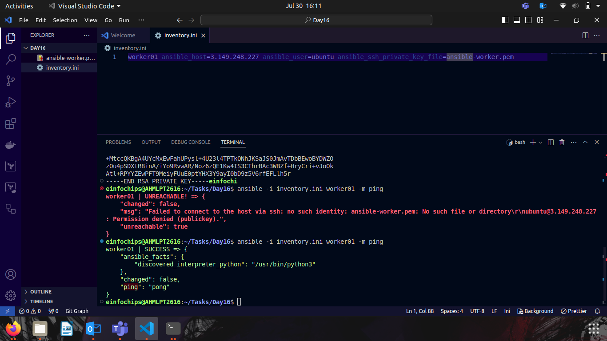

### Project:- 2
### Deliverables:
1. Task Execution:
    - Execute commands to check disk usage across all managed nodes
    - Restart a specific service on all managed nodes.
    - Update all packages on a subset of managed nodes.
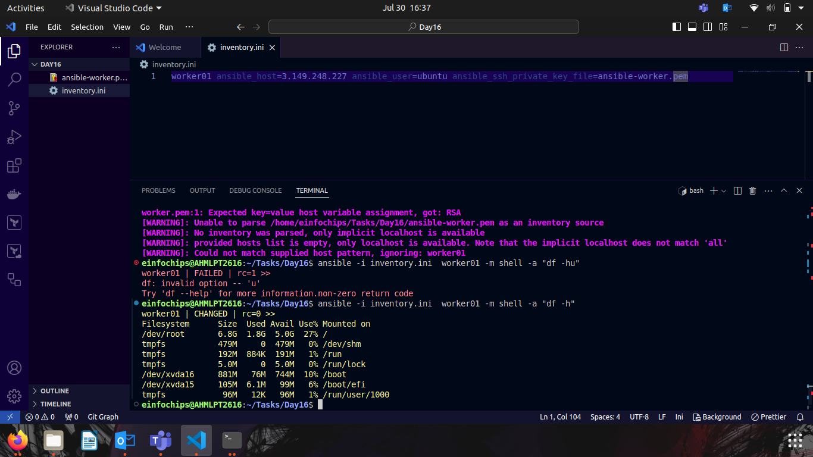
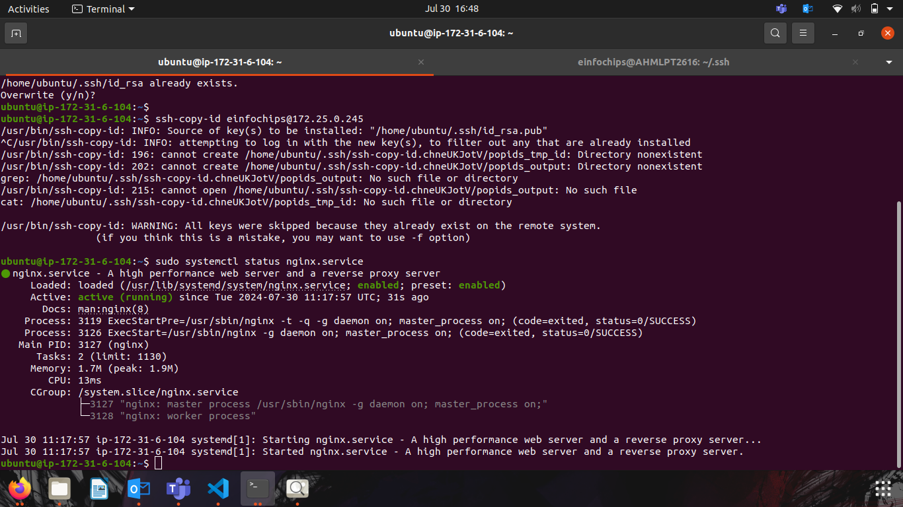
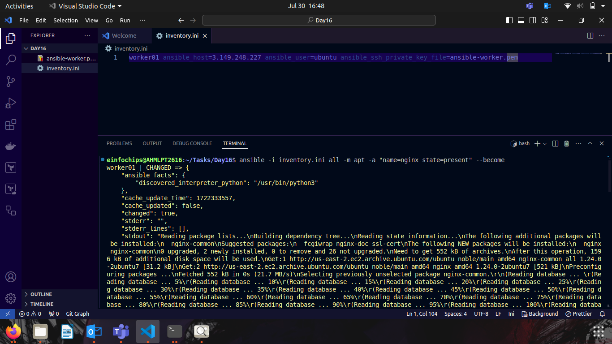

### Project:- 3
### Deliverables
1. Static Inventory:
    - Create a static inventory file with different groups for various environments and roles.
    - Verify that the inventory is correctly structured and accessible by Ansible.
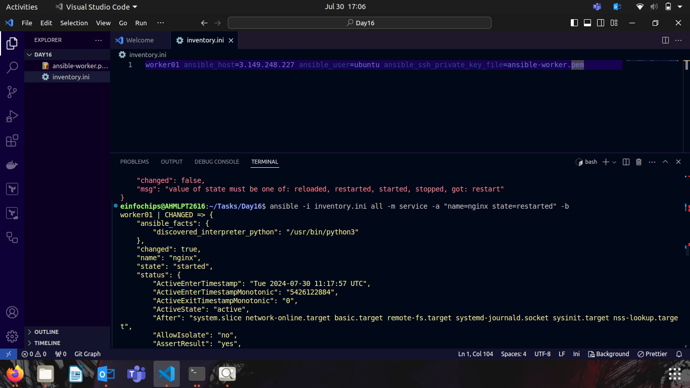
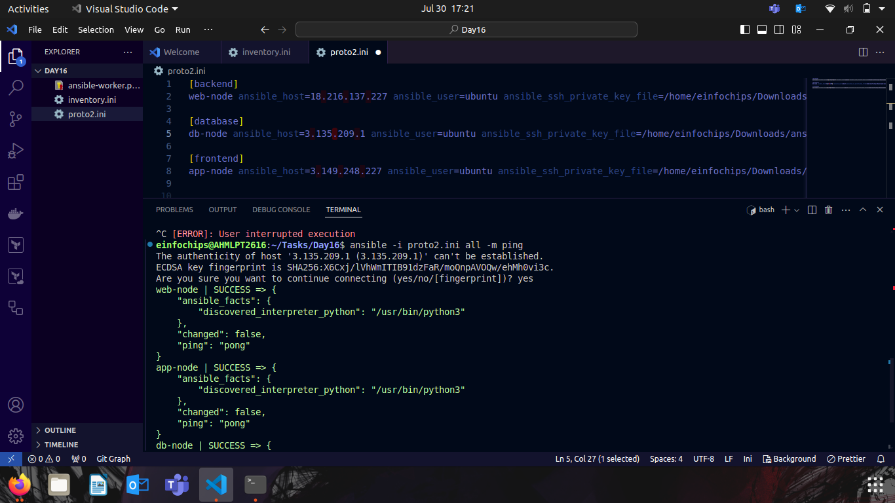

### Project:- 4
### Deliverables
1. Playbook Creation:
    - Write a playbook to install a specific package on all managed nodes.
    - Create a playbook to configure a service with specific parameters.
    - Develop a playbook to manage files, such as creating, deleting, and modifying files on managed nodes.
2. Testing and Verification:
    - Test the playbooks to ensure they run successfully and perform the intended tasks.
    - Validate the changes made by the playbooks on the managed nodes.
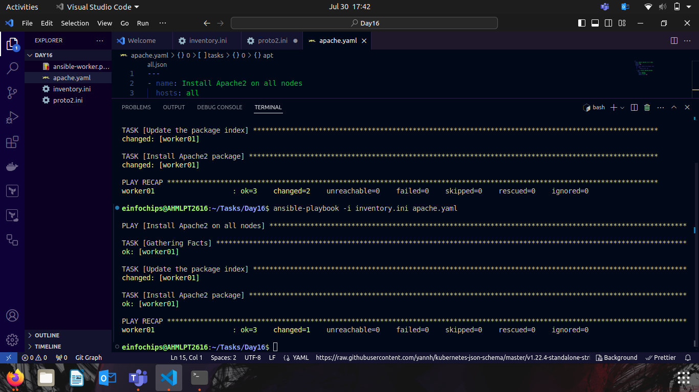
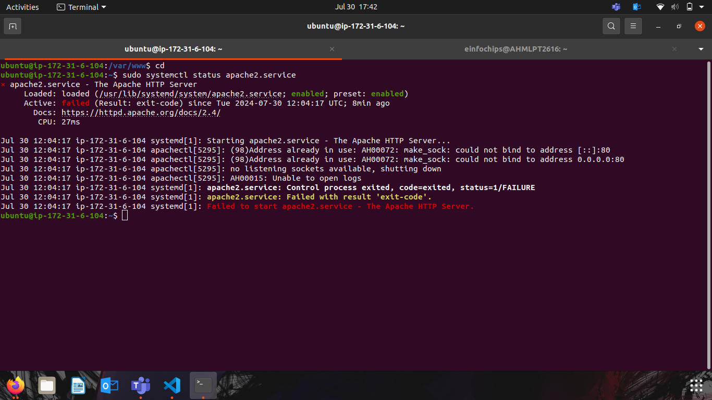
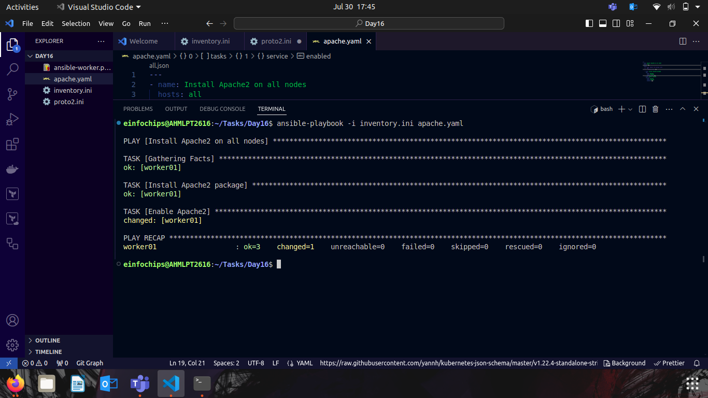
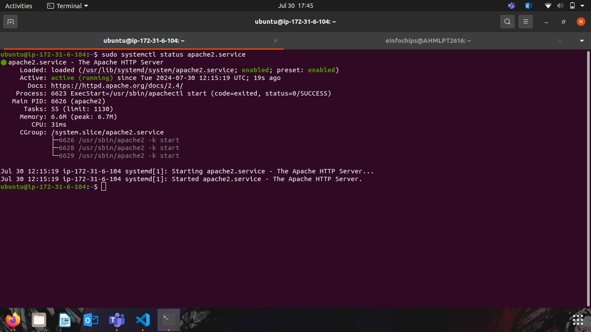
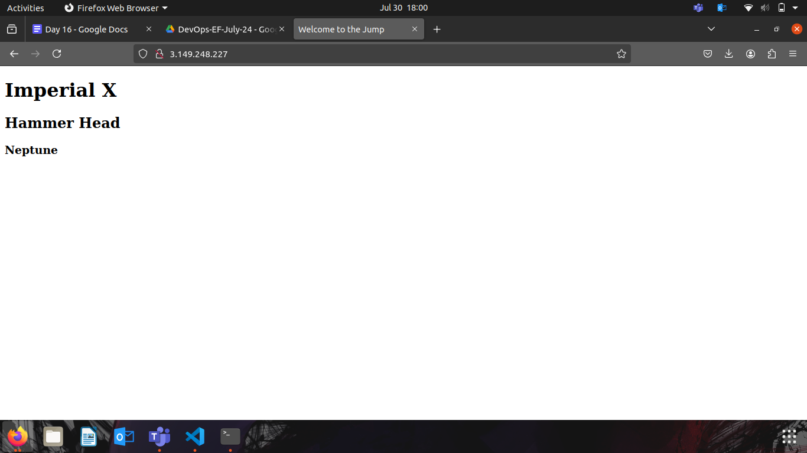

