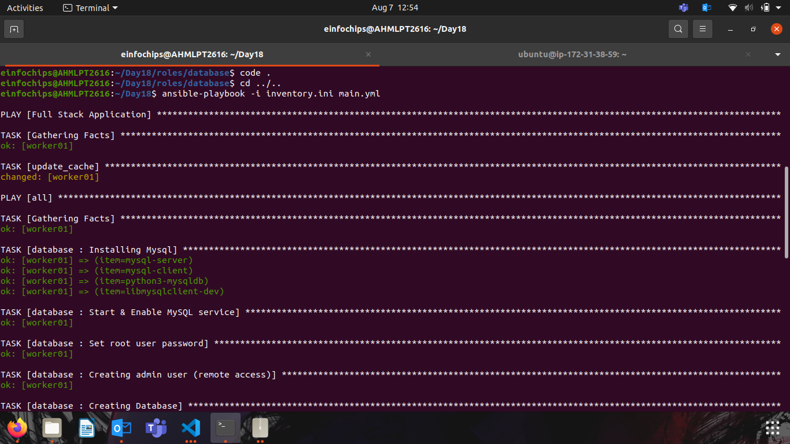

## Project 18
#### Task:-
You are tasked with deploying a three-tier web application (frontend, backend, and database) using Ansible roles. The frontend is an Nginx web server, the backend is a Node.js application, and the database is a MySQL server. Your solution should use Ansible Galaxy roles where applicable and define appropriate role dependencies. The deployment should be automated to ensure that all components are configured correctly and can communicate with each other.

### Deliverables
1. Ansible Project Directory Structure Organized directory structure with roles, playbooks, inventory, and configuration files.


2.  Role Definitions and Dependencies meta/main.yml files for each role defining dependencies. Customized roles with necessary configurations.

3. Inventory File Inventory file defining groups and hosts for frontend, backend, and database tiers.


4.Playbook for Deployment (main.yml) Playbook that orchestrates the deployment of the three-tier application.
```yml
---
- name: Full Stack Application
  hosts: app
  become: yes
  tasks:
    - name: update_cache
      apt:
        update_cache: yes
  
- hosts: all
  become: true
  roles: 
    - frontend

- hosts: all
  become: true
  roles: 
    - backend

- hosts: all
  become: true
  roles: 
    - database
```

5. Playbook for Testing (test.yml) Playbook that verifies the deployment and functionality of each tier.



6. Frontend Page

