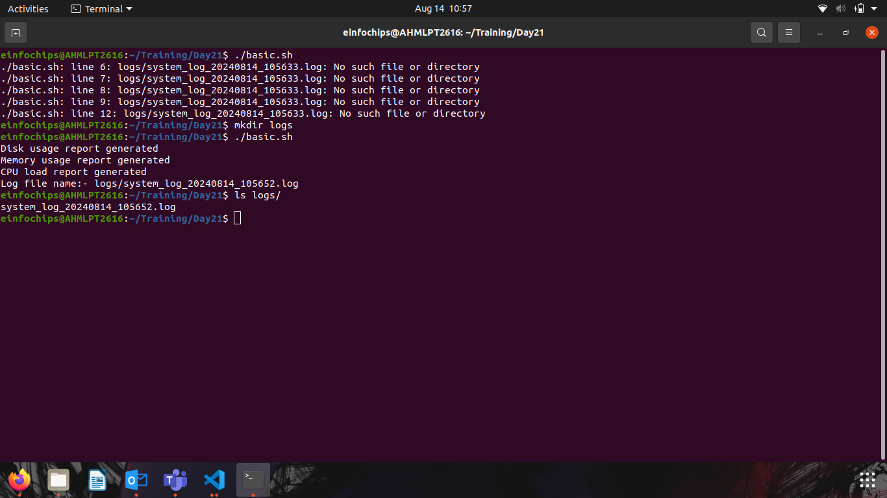
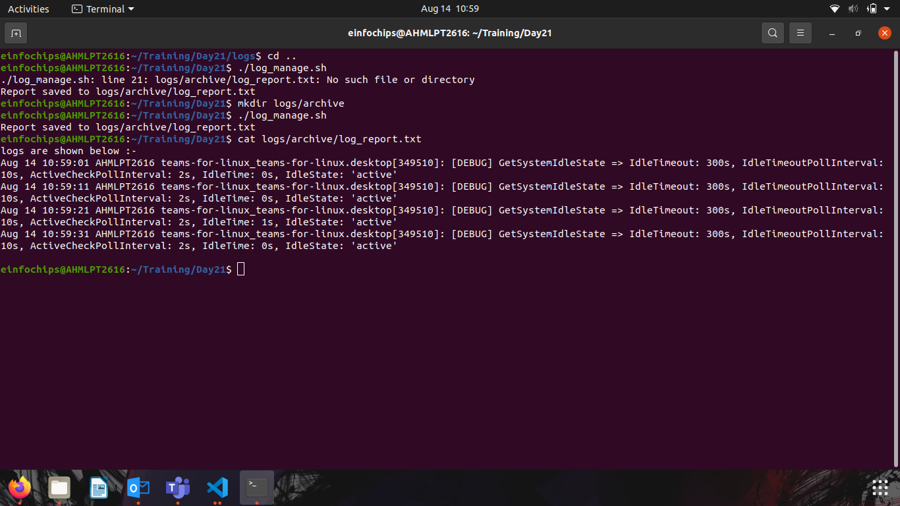
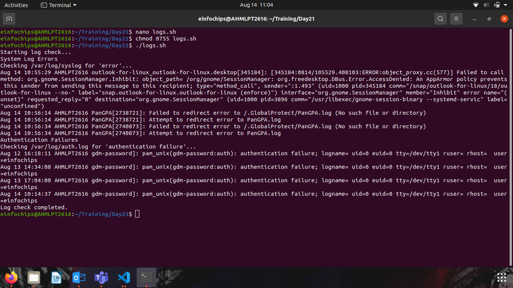

# Day 21 Task
## Project Overview:
### The goal of this capstone project is to combine shell scripting with system monitoring and log management practices. You will create a set of automated tools using shell scripts to manage logs, monitor system performance using Prometheus and Node Exporter, and generate insights using PromQL queries. The project will require a systematic approach, covering scripting fundamentals, log management, and monitoring setup.

#### Task: Install and configure Prometheus and Node Exporter on the system. Ensure that Node Exporter is properly configured to collect system metrics.

## Prometheus running and Node exporter running

#### Task: Create a series of PromQL queries to monitor system performance, such as CPU usage, memory usage, and disk I/O.

- A set of PromQL queries that can be used to monitor key system metrics.
- A dashboard setup guide or configuration that visualizes these metrics in Prometheus or Grafana.

## Graphical Representation of the usage!!

### Shell Scripts for Basic Operations:
- Task: Write shell scripts to perform basic system operations, such as checking disk usage, memory usage, and CPU load.
#### Deliverable:
- A collection of scripts that output system performance metrics.
- Scripts should include error handling and logging.

#### Log Management Script:
- Task: Develop a script to automate log management tasks such as log rotation and archiving. This script should include the ability to compress old logs and delete logs older than a specified number of days.

### Advanced Shell Scripting - Loops, Conditions, Functions, and Error Handling:
- Task: Refactor the previous scripts to include loops, conditionals, and functions for modularity. Implement error handling to manage potential issues during script execution.

### Log Checking and Troubleshooting:
- Task: Write a script that reads through system and application logs, identifies common issues (e.g., out of memory, failed service starts), and provides troubleshooting steps based on log analysis.

