## Project 01

#### Project Breakdown
1. Configuring Jobs and Targets
- Task: Set up a Prometheus server to monitor multiple services running on different nodes.
Deliverables:
- Configure Prometheus with jobs for monitoring different services like web servers, databases, and system metrics.
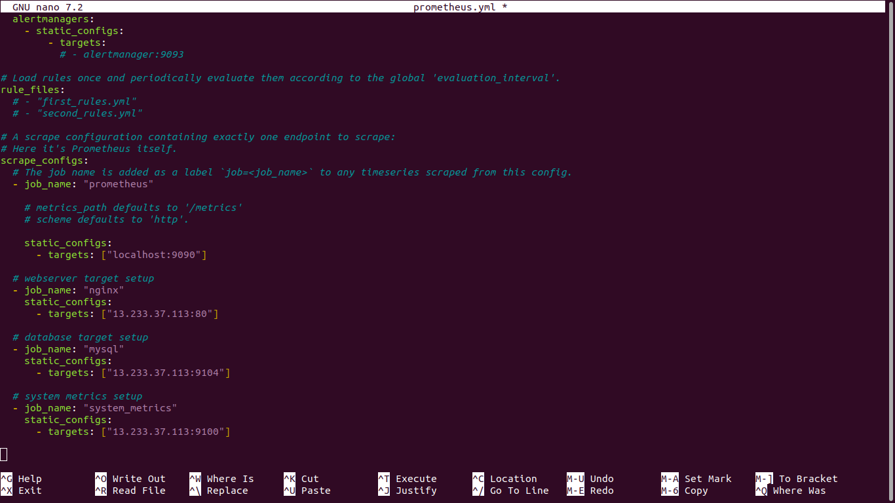

2. Using Exporters (Node Exporter)
- Task: Use Node Exporter to monitor system-level metrics like CPU, memory, disk usage, and network statistics.
Deliverables:
- Install and configure Node Exporter on all nodes.
- Ensure Node Exporter metrics are being correctly scraped by Prometheus.

3. Hands-on Exercise: Setting Up Exporters
- Task: Configure at least two different types of exporters (e.g., Node Exporter and MySQL Exporter) and integrate them with Prometheus.
Deliverables:
- Demonstrate successful data collection from both exporters.
- Create a basic Prometheus dashboard to visualize key metrics from these exporters.
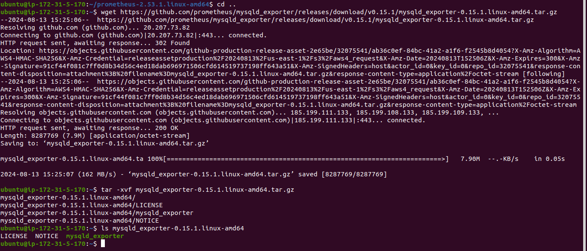

4. Introduction to PromQL
- Task: Learn and implement basic PromQL queries to extract meaningful data from the metrics collected.
Deliverables:
- Write basic queries to retrieve metrics like average CPU usage, memory consumption, and disk I/O over time.

- Graph of memory
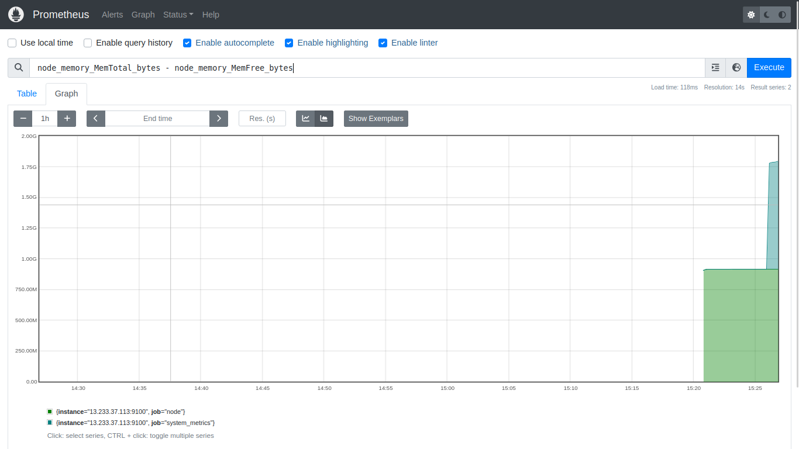

- Graph of disk 
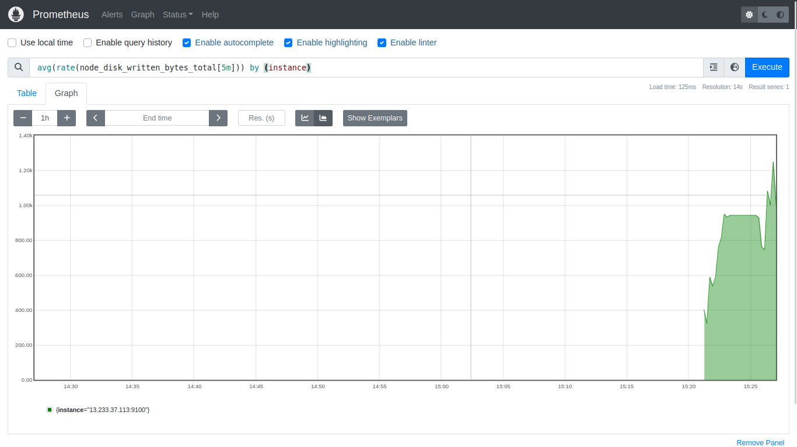

5.  Basic Queries (Selectors, Functions, Operators)
- Task: Create PromQL queries using selectors, functions, and operators to filter and manipulate time-series data.

- Write PromQL queries to calculate the 95th percentile of CPU usage.
- Use functions like rate(), increase(), and histogram_quantile() to perform more complex analysis.

6. Advanced Queries and Aggregations
Task: Perform advanced data aggregation using PromQL.

- Write queries to calculate the total memory usage across all nodes.
- Aggregate data to find the maximum disk space usage among all nodes.
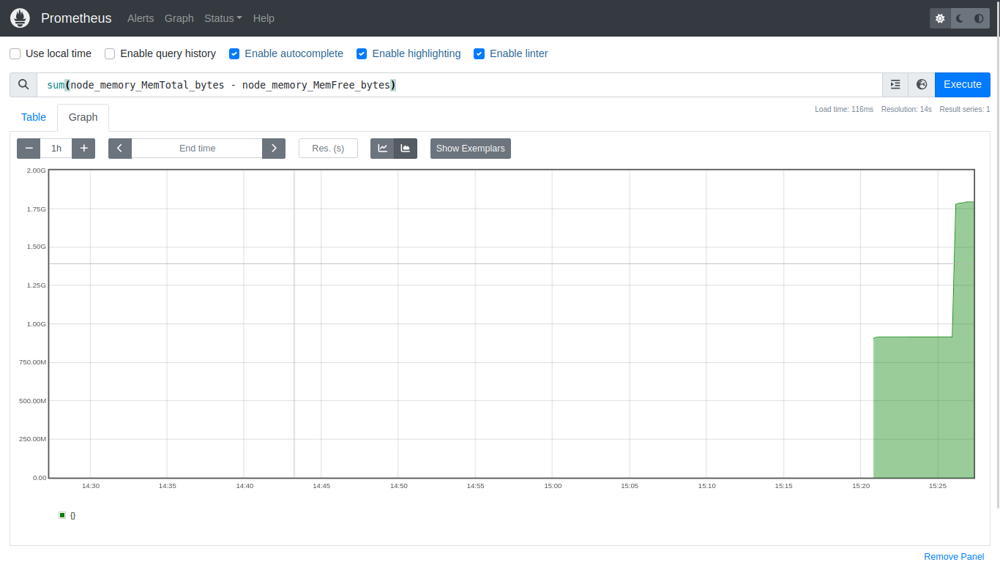
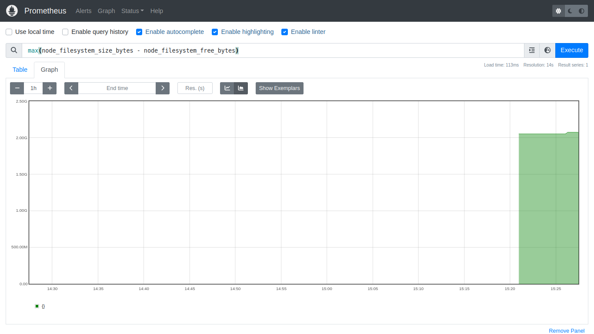

7. Configuring Alertmanager
- Task: Set up Alertmanager to handle alerts generated by Prometheus.

- Configure Alertmanager with Prometheus.
- Create routing rules to manage alert notifications based on severity and service type.

8. Writing Alerting Rules
- Task: Write custom alerting rules in Prometheus to trigger alerts based on specific conditions.

- Create alerting rules for high CPU usage, memory leaks, and disk space running low.
- Ensure alerts are correctly generated and sent to Alertmanager.
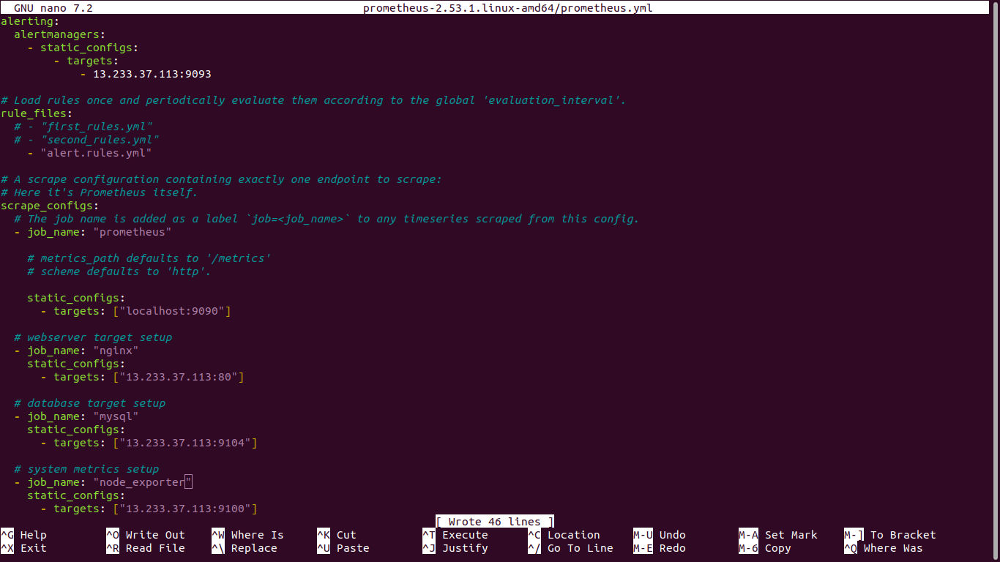

9. Setting Up Notification Channels (Email, Slack, etc.)
- Task: Integrate Alertmanager with multiple notification channels like Email and Slack.

- Set up Email notifications for critical alerts.
Integrate Slack for real-time alerts and notifications.
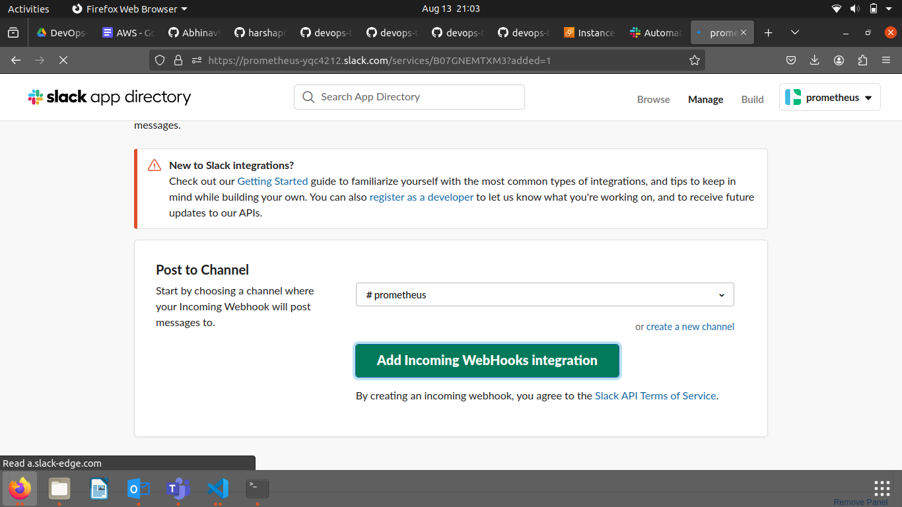
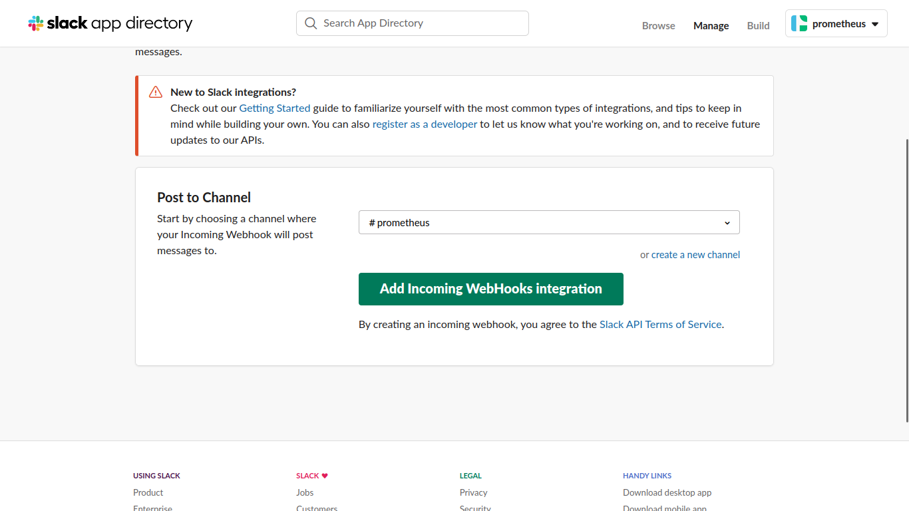

10. Hands-on Exercise: Creating Alerts
- Task: Test the entire alerting pipeline by creating and triggering custom alerts.

- Simulate a scenario where a node exceeds 90% CPU usage and ensure alerts are triggered and sent to both Email and Slack.
- Validate the alerts in both notification channels.
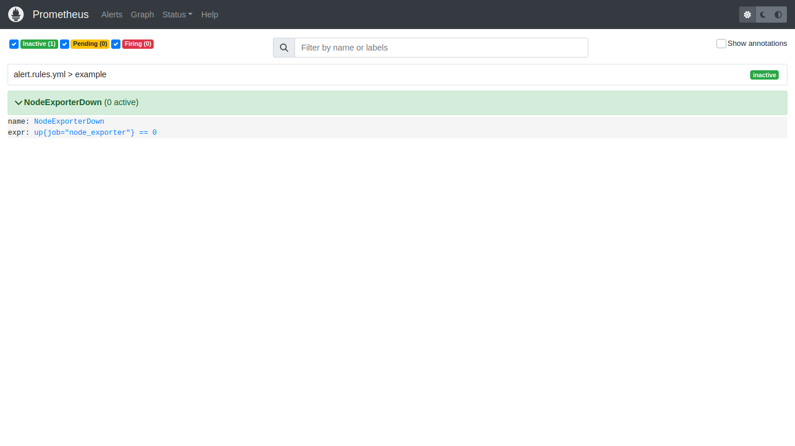
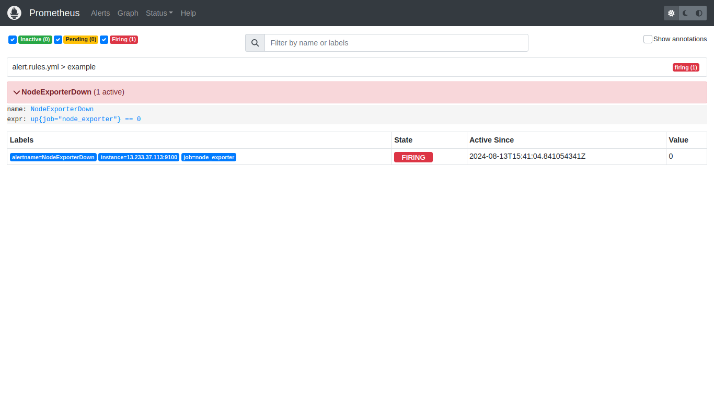
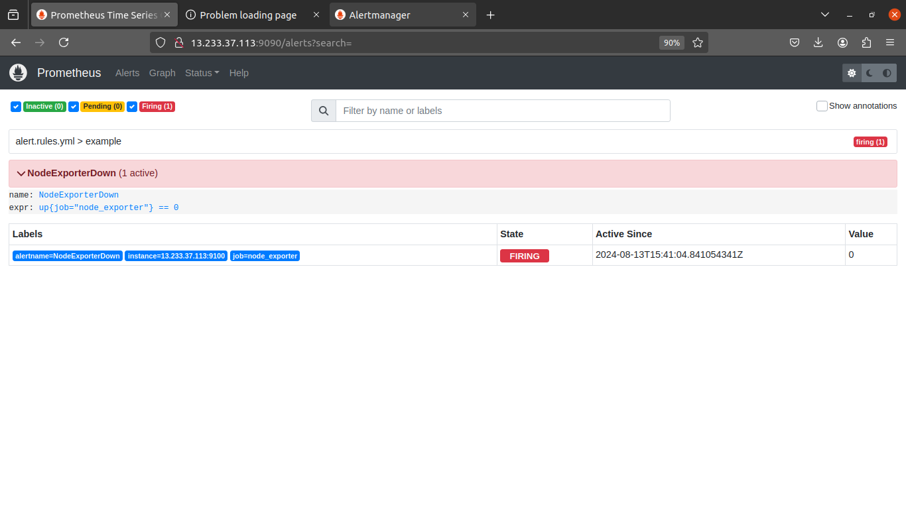
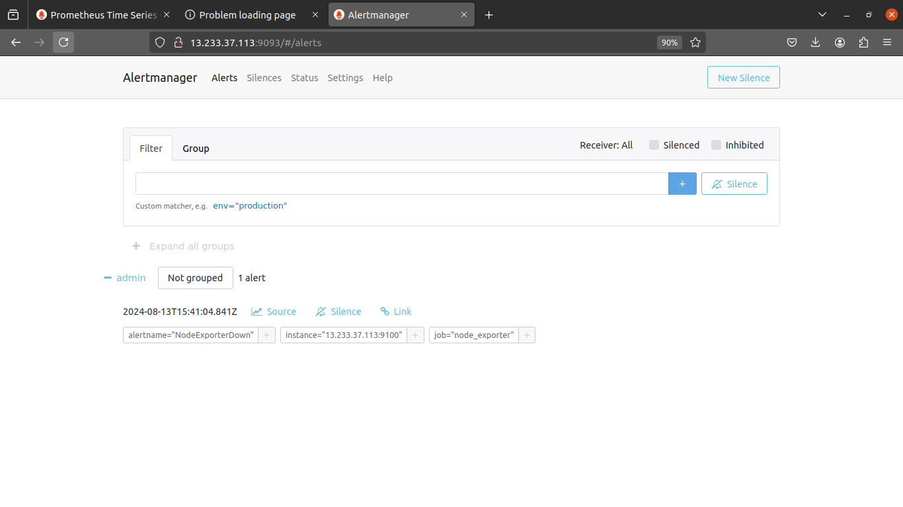
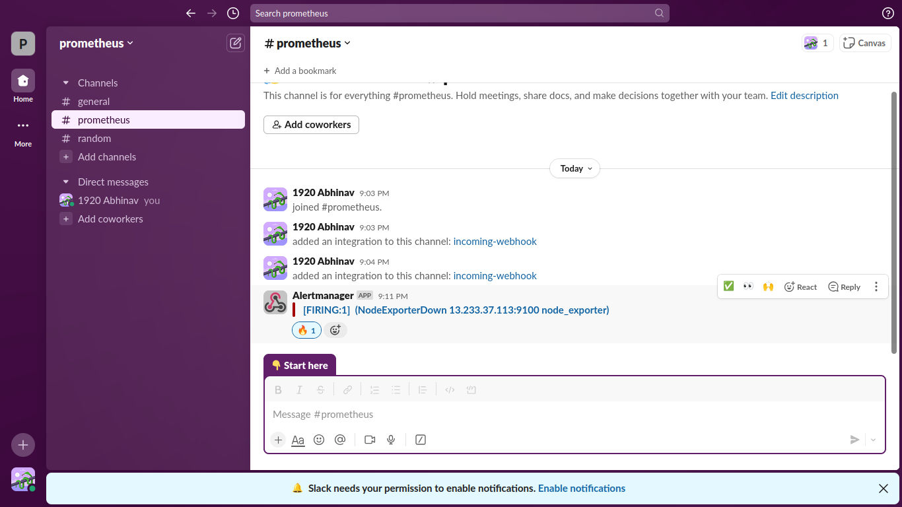

