# Project 01
- Project Overview
In this project, we'll go through all three lifecycles of Docker: pulling an image and creating a container, modifying the container and creating a new image, and finally, creating a Dockerfile to build and deploy a web application.
- Creating a Container from a Pulled Image
Objective: Pull the official Nginx image from Docker Hub and run it as a container.
> Steps:

Pull the Nginx Image:
```bash
docker pull nginx
```

Run the Nginx Container:
```bash
docker run --name my-nginx -d -p 8080:80 nginx
```

Verify the Container is Running:
```bash
docker ps
```

- Visit http://localhost:8080 in your browser. You should see the Nginx welcome page.

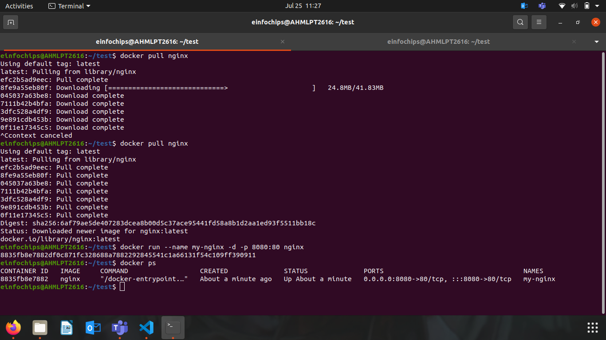
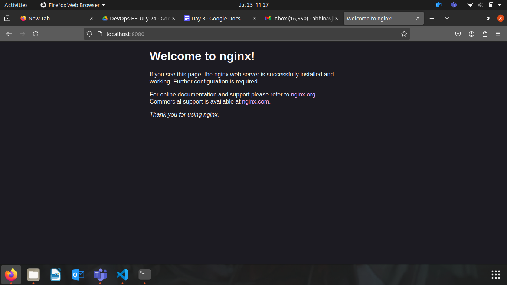
### Modifying the Container and Creating a New Image

Access the Running Container:
```bash
docker exec -it my-nginx /bin/bash
```

Create a Custom HTML Page:
```bash
echo "<html><body><h1>Hello from Docker!</h1></body></html>" > /usr/share/nginx/html/index.html
```

Exit the Container:
```bash
exit
```

Commit the Changes to Create a New Image:
```bash
docker commit my-nginx custom-nginx
```

Run a Container from the New Image:
```bash
docker run --name my-custom-nginx -d -p 8081:80 custom-nginx
```

- Verify the New Container:
> Visit http://localhost:8081 in your browser. You should see your custom HTML page.
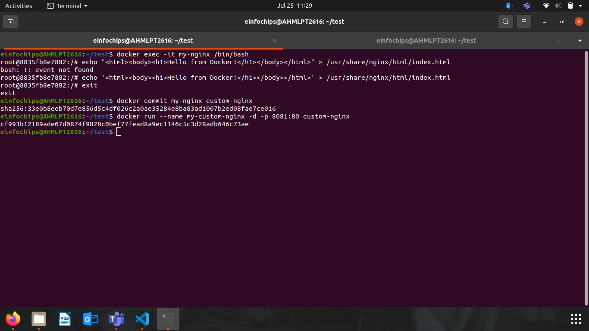
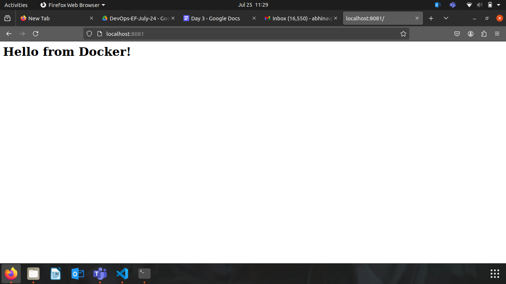

### Creating a Dockerfile to Build and Deploy a Web Application
Objective: Write a Dockerfile to create an image for a simple web application and run it as a container.

Create a Project Directory:
```bash
mkdir my-webapp
cd my-webapp
```

### Create a Simple Web Application:

Create an index.html file:
```html
<!DOCTYPE html>
<html>
<body>
    <h1>Hello from My Web App!</h1>
</body>
</html>
```

Save this file in the my-webapp directory.

### Write the Dockerfile:
Create a Dockerfile in the my-webapp directory with the following content:

### Use the official Nginx base image
```Dockerfile
FROM nginx:latest


COPY index.html /usr/share/nginx/html/


EXPOSE 80


Build the Docker Image:
```bash
docker build -t my-webapp-image .
```

Run a Container from the Built Image:
```bash
docker run --name my-webapp-container -d -p 8082:80 my-webapp-image

```

> Verify the Web Application:

Visit http://localhost:8082 in your browser. We should see your custom web application.

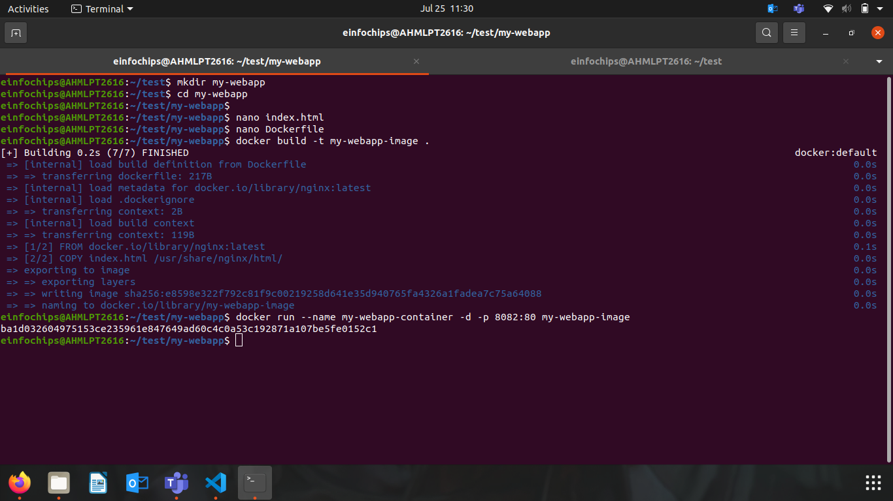
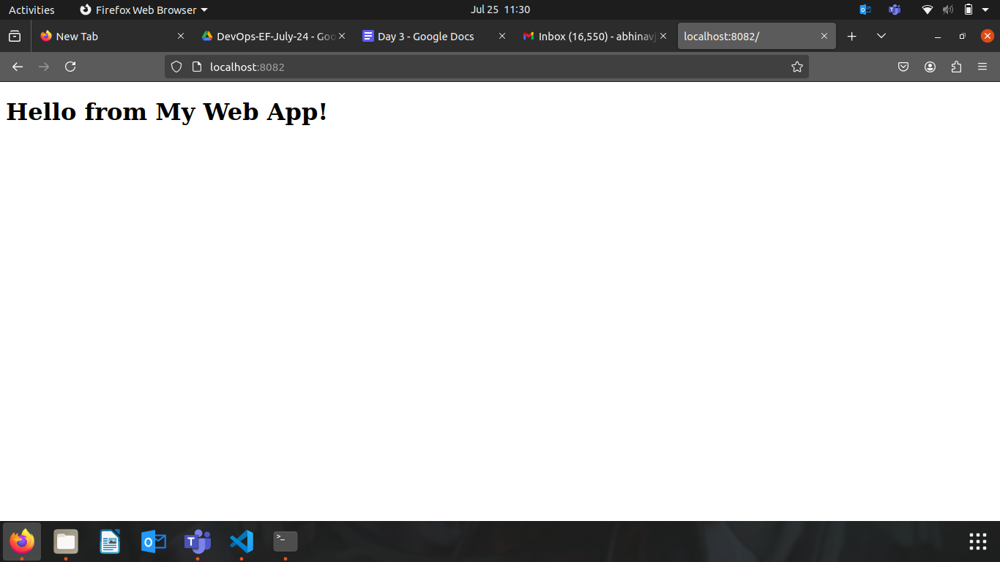

### Cleaning Up
Objective: Remove all created containers and images to clean up your environment.

> Stop and Remove the Containers:
```bash
docker stop my-nginx my-custom-nginx my-webapp-container
docker rm my-nginx my-custom-nginx my-webapp-container
```
Remove the Images:
```bash
docker rmi nginx custom-nginx my-webapp-image
```

# Project 02
Project Overview
In this advanced project, we'll build a full-stack application using Docker. The application will consist of a front-end web server (Nginx), a back-end application server (Node.js with Express), and a PostgreSQL database. We will also set up a persistent volume for the database and handle inter-container communication. This project will take more time and involve more detailed steps to ensure thorough understanding.

> Setting Up the Project Structure

Objective: Create a structured project directory with necessary configuration files.

> Create the Project Directory:
```bash
mkdir fullstack-docker-app
cd fullstack-docker-app
```

Create Subdirectories for Each Service:
```bash
mkdir frontend backend database
```

### Create Shared Network and Volume:

Docker allows communication between containers through a shared network.
```bash
docker network create fullstack-network
```

> Create a volume for the PostgreSQL database.
```bash
docker volume create pgdata
```
### Setting Up the Database
> Objective: Set up a PostgreSQL database with Docker.

Create a Dockerfile for PostgreSQL:

```Dockerfile
FROM postgres:latest
ENV POSTGRES_USER=user
ENV POSTGRES_PASSWORD=password
ENV POSTGRES_DB=mydatabase
```

Build the PostgreSQL Image:
```bash
cd database
docker build -t my-postgres-db .
cd ..
```

Run the PostgreSQL Container:
```bash
docker run --name postgres-container --network fullstack-network -v pgdata:/var/lib/postgresql/data -d my-postgres-db
```
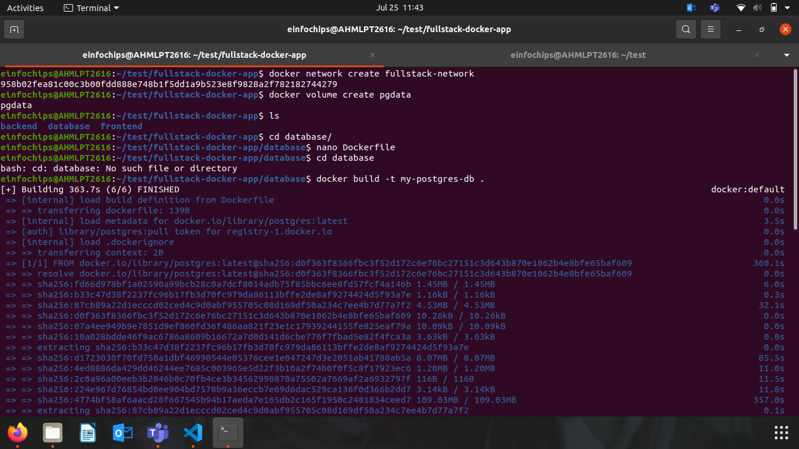
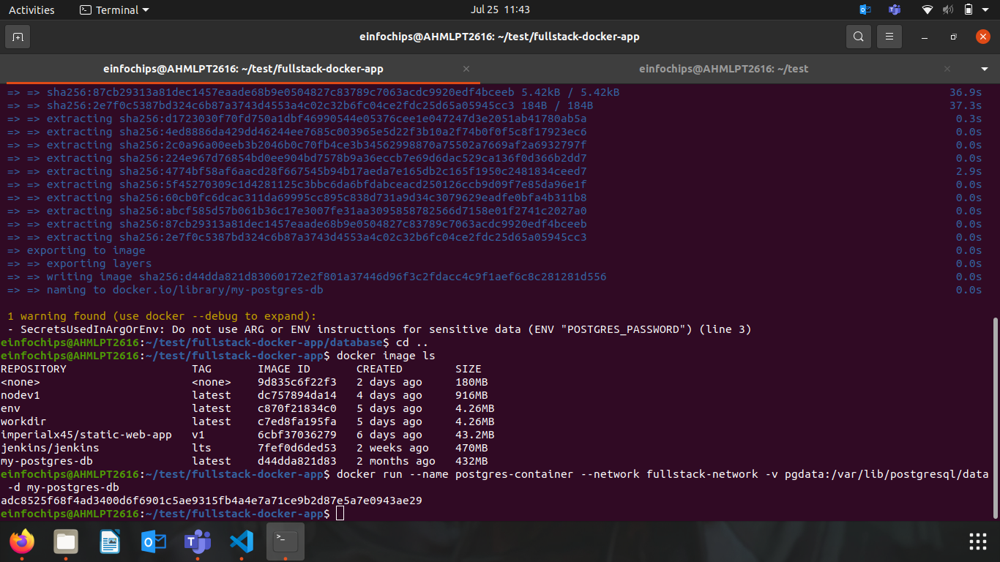
### Setting Up the Backend (Node.js with Express)


> Initialize the Node.js Application:
```bash
cd backend
npm init -y
```

> Install Express and pg (PostgreSQL client for Node.js):
```bash
npm install express pg
```

> Create the Application Code:

- In the backend directory, create a file named index.js with the following content:

```js
const express = require('express');
const { Pool } = require('pg');
const app = express();
const port = 3000;

const pool = new Pool({
    user: 'user',
    host: 'postgres-container',
    database: 'mydatabase',
    password: 'password',
    port: 5432,
});

app.get('/', (req, res) => {
    res.send('Hello from Node.js and Docker!');
});

app.get('/data', async (req, res) => {
    const client = await pool.connect();
    const result = await client.query('SELECT NOW()');
    client.release();
    res.send(result.rows);
});

app.listen(port, () => {
    console.log(`App running on http://localhost:${port}`);
});

```

### Create a Dockerfile for the Backend:
In the backend directory, create a file named Dockerfile with the following content:
```Dockerfile
FROM node:latest

WORKDIR /usr/src/app

COPY package*.json ./
RUN npm install

COPY . .

EXPOSE 3000
CMD ["node", "index.js"]
```

> Build the Backend Image:
```bash
docker build -t my-node-app .
cd ..
```
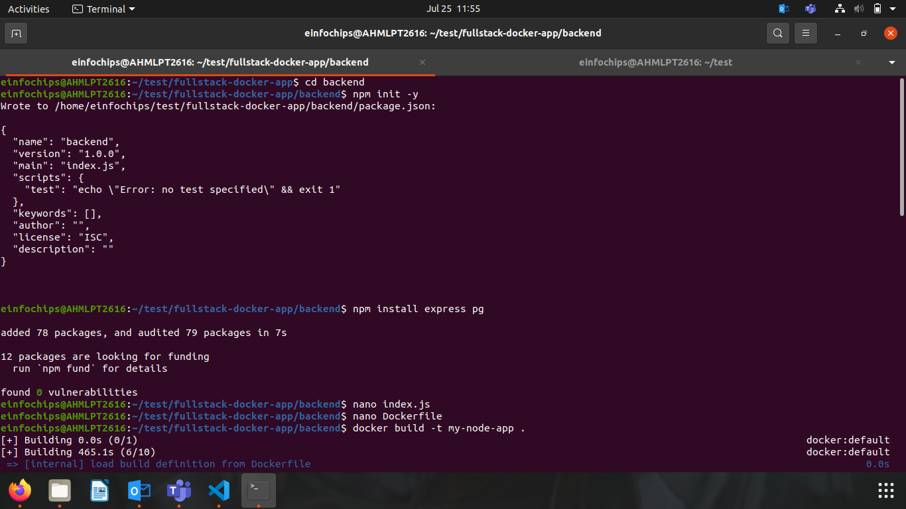
> Run the Backend Container:
```bash
docker run --name backend-container --network fullstack-network -d my-node-app
```
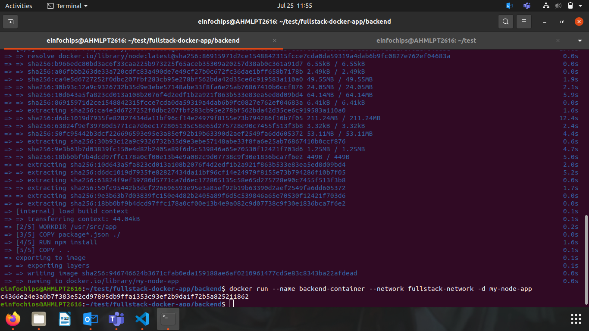
### Setting Up the Frontend (Nginx)
> Objective: Create a simple static front-end and set it up with Docker.


Create a Simple HTML Page:

In the frontend directory, create a file named index.html with the following content:
```html
<!DOCTYPE html>
<html>
<body>
    <h1>Hello from Nginx and Docker!</h1>
    <p>This is a simple static front-end served by Nginx.</p>
</body>
</html>
```

### Create a Dockerfile for the Frontend:

In the frontend directory, create a file named Dockerfile with the following content:

```Dockerfile
FROM nginx:latest
COPY index.html /usr/share/nginx/html/index.html
```

- Build the Frontend Image:
```bash
cd frontend
docker build -t my-nginx-app .
cd ..
```

- Run the Frontend Container:
```bash
docker run --name frontend-container --network fullstack-network -p 8080:80 -d my-nginx-app
```
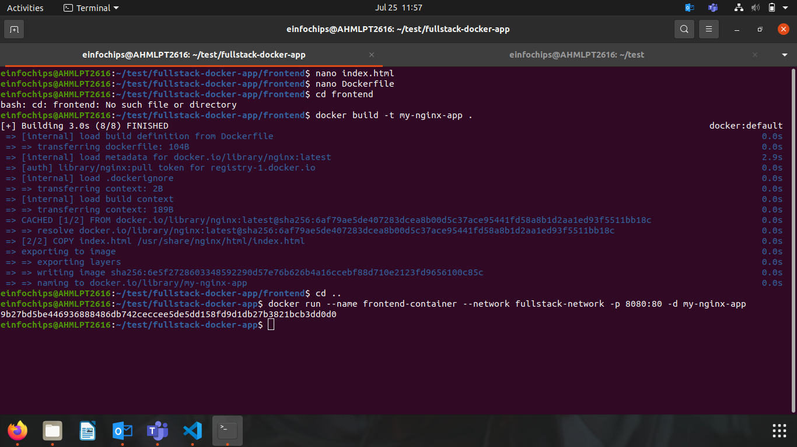
### Connecting the Backend and Database
> Objective: Ensure the backend can communicate with the database and handle data requests.


Update Backend Code to Fetch Data from PostgreSQL:

Ensure that the index.js code in the backend handles /data endpoint correctly as written above.

Verify Backend Communication:

Access the backend container:
```bash
docker exec -it backend-container /bin/bash
```

> Test the connection to the database using psql:
```bash
apt-get update && apt-get install -y postgresql-client
psql -h postgres-container -U user -d mydatabase -c "SELECT NOW();"
```
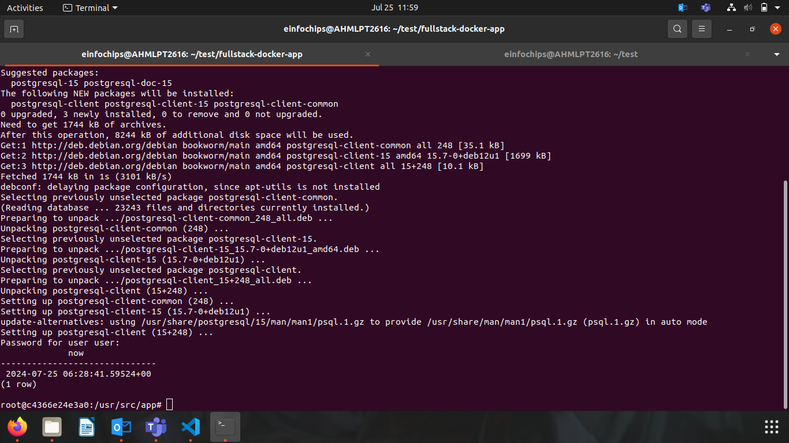
Exit the container:
```bash
exit
```

### Test the Backend API:
- Visit http://localhost:3000 to see the basic message.
- Visit http://localhost:3000/data to see the current date and time fetched from PostgreSQL.

### Final Integration and Testing
> Objective: Ensure all components are working together and verify the full-stack application.


Access the Frontend:

- Visit http://localhost:8080 in your browser. You should see the Nginx welcome page with the custom HTML.

> Verify Full Integration:
- Update the index.html to include a link to the backend:
```html
<!DOCTYPE html>
<html>
<body>
    <h1>Hello from Nginx and Docker!</h1>
    <p>This is a simple static front-end served by Nginx.</p>
    <a href="http://localhost:3000/data">Fetch Data from Backend</a>
</body>
</html>
```

Rebuild and Run the Updated Frontend Container:
```bash
cd frontend
docker build -t my-nginx-app .
docker stop frontend-container
docker rm frontend-container
docker run --name frontend-container --network fullstack-network -p 8080:80 -d my-nginx-app
cd ..
```
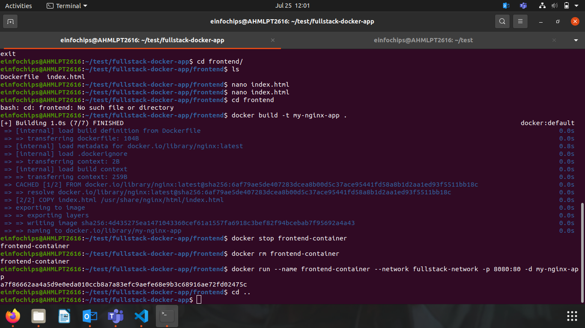 
### Final Verification:
- Visit http://localhost:8080 and click the link to fetch data from the backend.
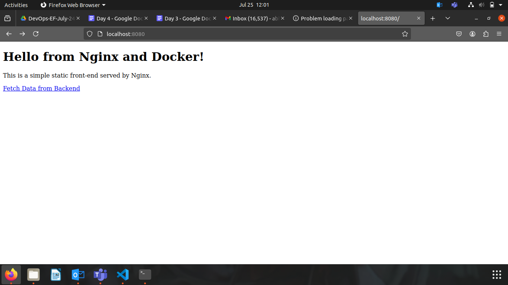
