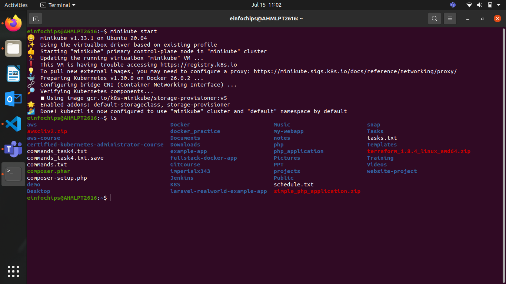
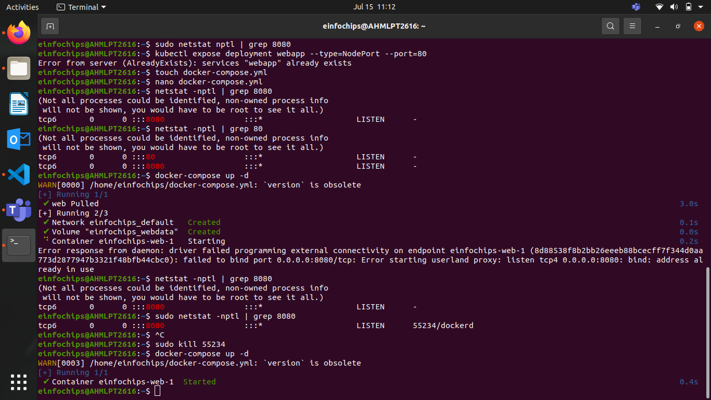
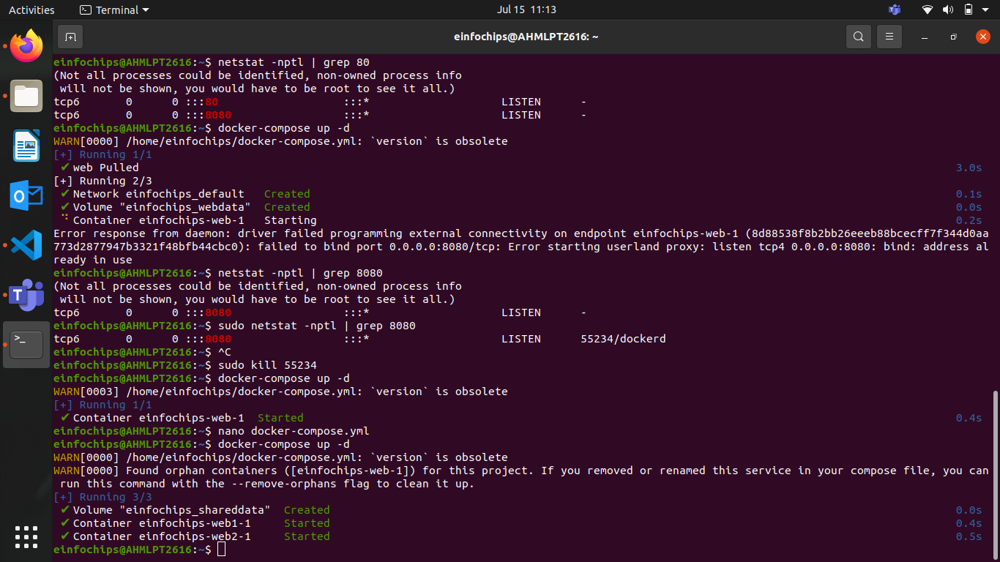
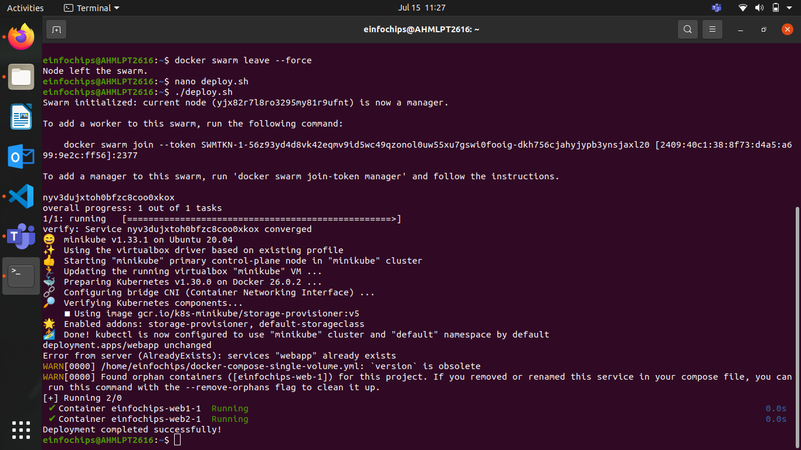
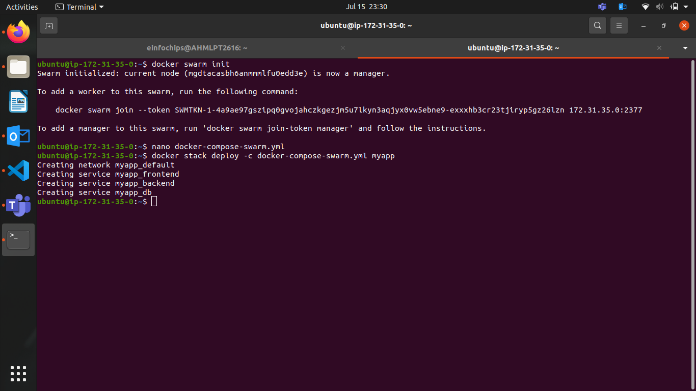
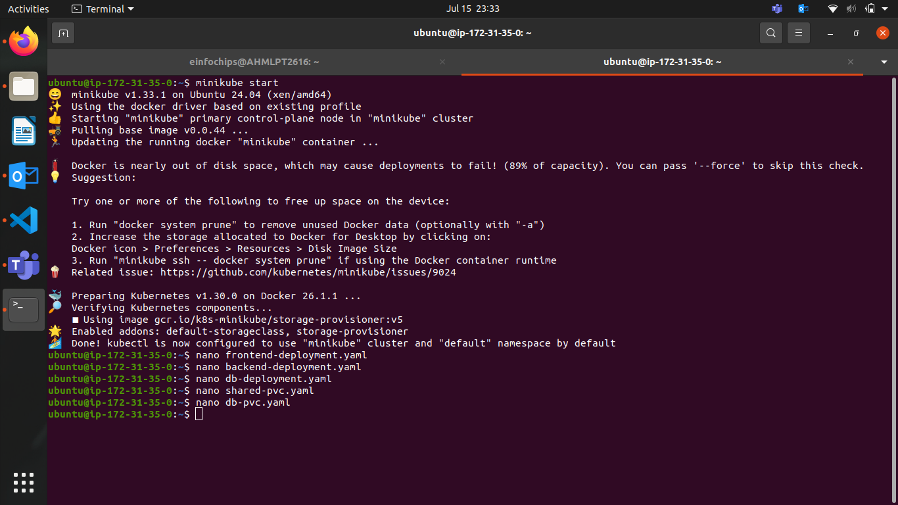
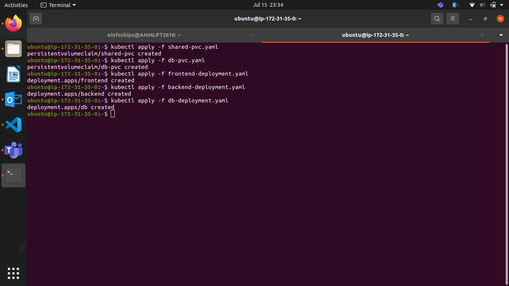
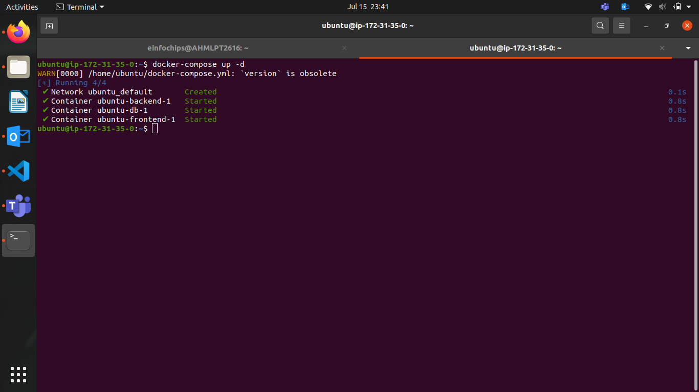

# Project 01 
## Deploying a Scalable Web Application with Persistent Storage and Advanced Automation

Deploy a scalable web application using Docker Swarm and Kubernetes, ensuring data persistence using a single shared volume, and automate the process using advanced shell scripting.
Overview:

### Step 1: Set up Docker Swarm and Create a Service
#### Initialize Docker Swarm
```bash
docker swarm init
```
#### Create a Docker Swarm Service
- Create a simple Nginx service in Docker Swarm
```bash
docker service create --name nginx-service --publish 8080:80 nginx
```
#### Set up Kubernetes Using Minikube
- Start Minikube
```bash
minikube start
```

### Deploy a Web App on Kubernetes
> Create a deployment file named webapp-deployment.yaml:
```yml
apiVersion: apps/v1
kind: Deployment
metadata:
  name: webapp
spec:
  replicas: 3
  selector:
    matchLabels:
      app: webapp
  template:
    metadata:
      labels:
        app: webapp
    spec:
      containers:
      - name: webapp
        image: nginx
        ports:
        - containerPort: 80
```

> Apply the deployment:
```bash
kubectl apply -f webapp-deployment.yaml
```
### Expose the Deployment
```bash
kubectl expose deployment webapp --type=NodePort --port=80
```

### Deploy a Web Application Using Docker Compose
> Create a docker-compose.yml File
```yml
version: '3'
services:
  web:
    image: nginx
    ports:
      - "8080:80"
    volumes:
      - webdata:/usr/share/nginx/html

volumes:
  webdata:
```

## Deploy the Web Application

#### Deploy using Docker Compose
```bash
docker-compose up -d
```

> Use a Single Shared Volume Across Multiple Containers
- Update docker-compose.yml to Use a Shared Volume
```yml
version: '3'
services:
  web1:
    image: nginx
    ports:
      - "8081:80"
    volumes:
      - shareddata:/usr/share/nginx/html
  web2:
    image: nginx
    ports:
      - "8082:80"
    volumes:
      - shareddata:/usr/share/nginx/html

volumes:
  shareddata:
```

## Deploy using Docker Compose
```bash
docker-compose up -d
```


## Automate the Entire Process Using Advanced Shell Scripting

> Create a Shell Script deploy.sh
```bash
#!/bin/bash

# Initialize Docker Swarm
docker swarm init

# Create Docker Swarm Service
docker service create --name nginx-service --publish 8080:80 nginx

# Start Minikube
minikube start

# Create Kubernetes Deployment
kubectl apply -f webapp-deployment.yaml

# Expose the Deployment
kubectl expose deployment webapp --type=NodePort --port=80

# Deploy Web App Using Docker Compose
docker-compose -f docker-compose-single-volume.yml up -d

echo "Deployment completed successfully!"
```

- Before running this script ensure that every port mentioned above is free
    - we use the command
    ```bash
    netstat -nptl | grep portno.
    ```
    - To check the port and kill if anything runnung


> Make the script executable
```bash
chmod +x deploy.sh
```
 > Run the Script
```bash
./deploy.sh
```
***

***


# Project 02 
Comprehensive Deployment of a Multi-Tier Application with CI/CD Pipeline
Objective:
Deploy a multi-tier application (frontend, backend, and database) using Docker Swarm and Kubernetes, ensuring data persistence using a single shared volume across multiple containers, and automating the entire process using advanced shell scripting and CI/CD pipelines.
Overview:
- Step 1: Set up Docker Swarm and create a multi-tier service.
- Step 2: Set up Kubernetes using Minikube.
- Step 3: Deploy a multi-tier application    using Docker Compose.
- Step 4: Use a single shared volume across multiple containers.


### Initialize Docker Swarm
```bash
docker swarm init
```
- Create a Multi-Tier Docker Swarm Service
> Create a docker-compose-swarm.yml file:
```yml
version: '3.7'
services:
  frontend:
    image: nginx
    ports:
      - "8082:80"
    deploy:
      replicas: 2
    volumes:
      - shareddata:/usr/share/nginx/html
  backend:
    image: hello-world
    ports:
      - "8081:80"
    deploy:
      replicas: 2
    volumes:
      - shareddata:/app/data
  db:
    image: postgres
    environment:
      POSTGRES_DB: mydb
      POSTGRES_USER: user
      POSTGRES_PASSWORD: password
    deploy:
      replicas: 1
    volumes:
      - dbdata:/var/lib/postgresql/data

volumes:
  shareddata:
  dbdata:
```


### Deploy the stack using Docker Swarm
```bash
docker stack deploy -c docker-compose-swarm.yml myapp
```

### Set up Kubernetes Using Minikube
> Start Minikube
- check for kubectl and install if not present

### Start Minikube
```bash
minikube start
```
### Create Kubernetes Deployment Files

> Create frontend-deployment.yaml:
```yml
apiVersion: apps/v1
kind: Deployment
metadata:
  name: frontend
spec:
  replicas: 2
  selector:
    matchLabels:
      app: frontend
  template:
    metadata:
      labels:
        app: frontend
    spec:
      containers:
      - name: frontend
        image: nginx
        ports:
        - containerPort: 80
        volumeMounts:
        - name: shareddata
          mountPath: /usr/share/nginx/html
      volumes:
      - name: shareddata
        persistentVolumeClaim:
          claimName: shared-pvc
```

> Create backend-deployment.yaml:
```yml
apiVersion: apps/v1
kind: Deployment
metadata:
  name: backend
spec:
  replicas: 2
  selector:
    matchLabels:
      app: backend
  template:
    metadata:
      labels:
        app: backend
    spec:
      containers:
      - name: backend
        image: hello-world
        ports:
        - containerPort: 80
        volumeMounts:
        - name: shareddata
          mountPath: /app/data
      volumes:
      - name: shareddata
        persistentVolumeClaim:
          claimName: shared-pvc
```

> Create db-deployment.yaml:
```yml
apiVersion: apps/v1
kind: Deployment
metadata:
  name: db
spec:
  replicas: 1
  selector:
    matchLabels:
      app: db
  template:
    metadata:
      labels:
        app: db
    spec:
      containers:
      - name: db
        image: postgres
        env:
        - name: POSTGRES_DB
          value: mydb
        - name: POSTGRES_USER
          value: user
        - name: POSTGRES_PASSWORD
          value: password
        volumeMounts:
        - name: dbdata
          mountPath: /var/lib/postgresql/data
      volumes:
      - name: dbdata
        persistentVolumeClaim:
          claimName: db-pvc
```

> Create shared-pvc.yaml:
```yml
apiVersion: v1
kind: PersistentVolumeClaim
metadata:
  name: shared-pvc
spec:
  accessModes:
  - ReadWriteMany
  resources:
    requests:
      storage: 1Gi
```

> Create db-pvc.yaml:
```yml
apiVersion: v1
kind: PersistentVolumeClaim
metadata:
  name: db-pvc
spec:
  accessModes:
  - ReadWriteOnce
  resources:
    requests:
      storage: 1Gi
```

> Apply the deployments:
```bash
kubectl apply -f shared-pvc.yaml
kubectl apply -f db-pvc.yaml
kubectl apply -f frontend-deployment.yaml
kubectl apply -f backend-deployment.yaml
kubectl apply -f db-deployment.yaml
```

### Deploy a Multi-Tier Application Using Docker Compose

> Create a docker-compose.yml File
```yml
version: '3'
services:
  frontend:
    image: nginx
    ports:
      - "8082:80"
    volumes:
      - shareddata:/usr/share/nginx/html
  backend:
    image: hello-world
    ports:
      - "8081:80"
    volumes:
      - shareddata:/app/data
  db:
    image: postgres
    environment:
      POSTGRES_DB: mydb
      POSTGRES_USER: user
      POSTGRES_PASSWORD: password
    volumes:
      - dbdata:/var/lib/postgresql/data

volumes:
  shareddata:
  dbdata:
```

## Deploy the Application

> Deploy using Docker Compose
```bash
docker-compose up -d
```

## Use a Single Shared Volume Across Multiple Containers
Update docker-compose.yml as shown above to use the shareddata volume across the frontend and backend services.