# Project 01

In this project, we will develop a simple Node.js application, deploy it on a local Kubernetes cluster using Minikube, and configure various Kubernetes features. The project includes Git version control practices, creating and managing branches, and performing rebases. Additionally, we will work with ConfigMaps, Secrets, environment variables, and set up vertical and horizontal pod autoscaling.

### Project Steps
- Setup Minikube and Git Repository

> Start Minikube:
```bash
minikube start
```

> Set Up Git Repository
```bash
mkdir nodejs-k8s-project
cd nodejs-k8s-project
```

> Initialize Git repository:
```bash
git init
```
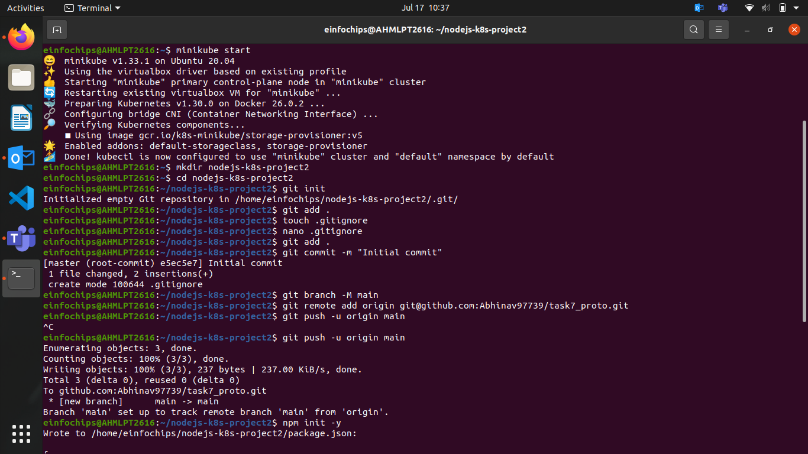
Create a .gitignore file:
```bash
nano .gitignore
```bash
- Paste the content into it
node_modules/
.env


> Add and commit initial changes:
```bash
git add .
git commit -m "Initial commit"
git push -u origin main
```

## Develop a Node.js Application


> Create the Node.js App
- Initialize the Node.js project:
```bash
npm init -y
```

> Install necessary packages:
```bash
npm install express body-parser
```

> Create app.js:
```js
const express = require('express');
const bodyParser = require('body-parser');
const app = express();
const PORT = process.env.PORT || 3000;

app.use(bodyParser.json());

app.get('/', (req, res) => {
  res.send('Hello, World!');
});

app.listen(PORT, () => {
  console.log(`Server is running on port ${PORT}`);
});
```

> Update package.json to include a start script:
```js
"scripts": {
  "start": "node app.js"
}
```

> Commit the Node.js Application
- Add and commit changes:
```bash
git add .
git commit -m "Add Node.js application code"
git push -u origin main
```

## Create Dockerfile and Docker Compose
- Create a Dockerfile

Add Dockerfile:
```Dockerfile 
# Use official Node.js image
FROM node:18

# Set the working directory
WORKDIR /usr/src/app

# Copy package.json and package-lock.json
COPY package*.json ./

# Install dependencies
RUN npm install

# Copy the rest of the application code
COPY . .

# Expose the port on which the app runs
EXPOSE 3000

# Command to run the application
CMD [ "npm", "start" ]
```
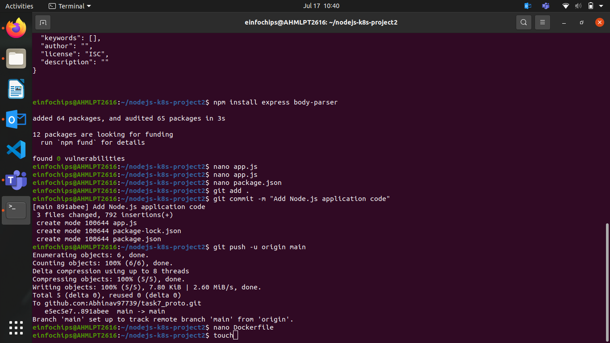
> Create a .dockerignore file:
```ignore
node_modules
.npm
```

## Create docker-compose.yml (optional for local testing)
> Add docker-compose.yml:
```yml
version: '3'
services:
  app:
    build: .
    ports:
      - "3000:3000"
```

> Add and commit changes:
```bash
git add Dockerfile docker-compose.yml
git commit -m "Add Dockerfile and Docker Compose configuration"
git push -u origin main
```

## Build and Push Docker Image
> Build Docker Image
```bash
docker build -t nodejs-app:latest .
```
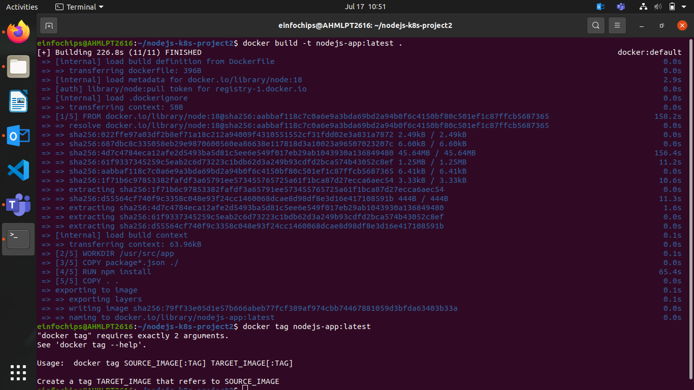
> Push Docker Image to Docker Hub
- Tag and push the image:
```bash
docker tag nodejs-app:latest your-dockerhub-username/nodejs-app:latest

docker push your-dockerhub-username/nodejs-app:latest
```

> Add and commit changes:
```bash
git add .
git commit -m "Build and push Docker image"
git push -u origin main
```
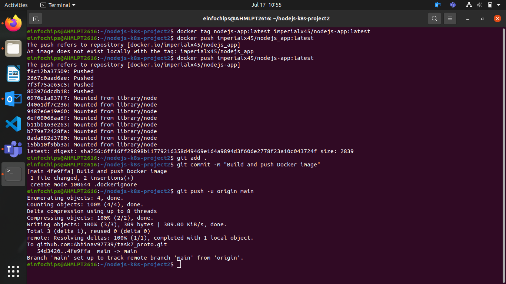
> Create Kubernetes Configurations
- Create Kubernetes Deployment
- Create kubernetes/deployment.yaml:
```yaml
apiVersion: apps/v1
kind: Deployment
metadata:
  name: nodejs-app-deployment
spec:
  replicas: 2
  selector:
    matchLabels:
      app: nodejs-app
  template:
    metadata:
      labels:
        app: nodejs-app
    spec:
      containers:
      - name: nodejs-app
        image: your-dockerhub-username/nodejs-app:latest
        ports:
        - containerPort: 3000
        env:
        - name: PORT
          valueFrom:
            configMapKeyRef:
              name: app-config
              key: PORT
        - name: NODE_ENV
          valueFrom:
            secretKeyRef:
              name: app-secrets
              key: NODE_ENV
```

> Create ConfigMap and Secret
- Create kubernetes/configmap.yaml:
```yaml
apiVersion: v1
kind: ConfigMap
metadata:
  name: app-config
data:
  PORT: "3000"
```

> Create kubernetes/secret.yaml:
```yaml
apiVersion: v1
kind: Secret
metadata:
  name: app-secrets
type: Opaque
data:
  NODE_ENV: cHJvZHVjdGlvbmFs # Base64 encoded value for "production"
```
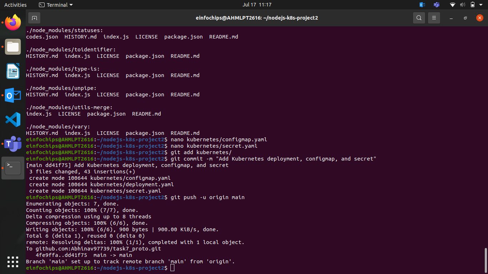
> Add and commit Kubernetes configurations:
```bash
git add kubernetes/
git commit -m "Add Kubernetes deployment, configmap, and secret"
git push -u origin main
```

> Apply Kubernetes Configurations
- Apply the ConfigMap and Secret:
```bash
kubectl apply -f kubernetes/configmap.yaml
kubectl apply -f kubernetes/secret.yaml
```

> Apply the Deployment:
```bash
kubectl apply -f kubernetes/deployment.yaml
```
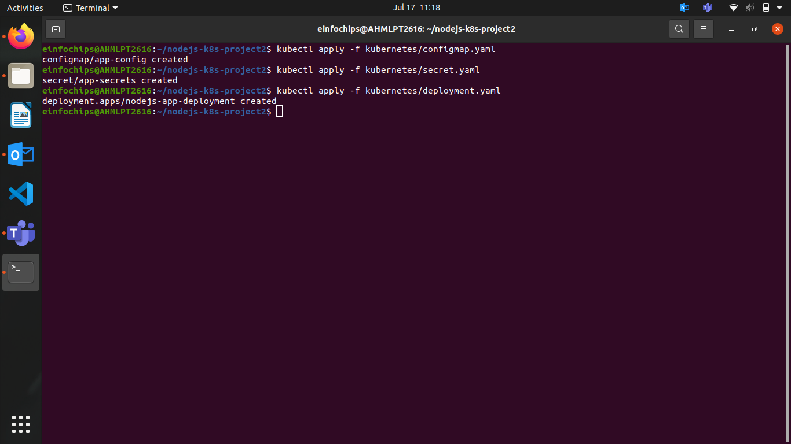
> Implement Autoscaling
- Create Horizontal Pod Autoscaler
- Create kubernetes/hpa.yaml:
```yaml
apiVersion: autoscaling/v2beta2
kind: HorizontalPodAutoscaler
metadata:
  name: nodejs-app-hpa
spec:
  scaleTargetRef:
    apiVersion: apps/v1
    kind: Deployment
    name: nodejs-app-deployment
  minReplicas: 2
  maxReplicas: 5
  metrics:
  - type: Resource
    resource:
      name: cpu
      target:
        type: Utilization
        averageUtilization: 50
```

- Apply the HPA:
```bash
kubectl apply -f kubernetes/hpa.yaml
```

> Create Vertical Pod Autoscaler
- Create kubernetes/vpa.yaml:
```yaml
apiVersion: autoscaling.k8s.io/v1beta2
kind: VerticalPodAutoscaler
metadata:
  name: nodejs-app-vpa
spec:
  targetRef:
    apiVersion: apps/v1
    kind: Deployment
    name: nodejs-app-deployment
  updatePolicy:
    updateMode: "Auto"
```

> Apply the VPA:
```bash 
kubectl apply -f kubernetes/vpa.yaml
```

> Test the Deployment
- Check the Status of Pods, Services, and HPA
- Verify the Pods:
```bash
kubectl get pods
```

> Verify the Services:
```bash 
kubectl get svc
```

- Verify the HPA:
```bash
kubectl get hpa
```
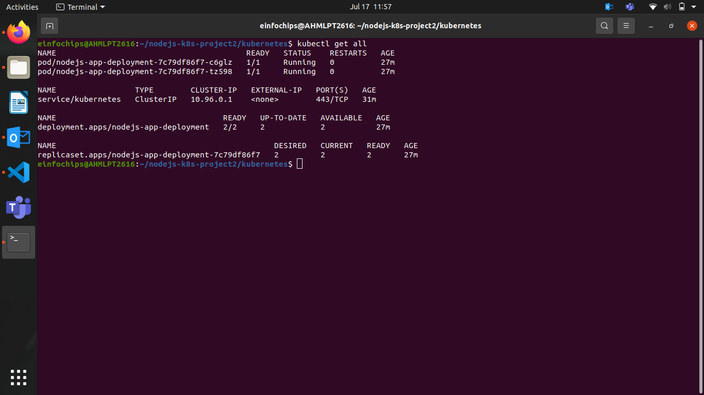
> Access the Application
- Expose the Service:
```bash
kubectl expose deployment nodejs-app-deployment --type=NodePort --name=nodejs-app-service
```

> Get the Minikube IP and Service Port:
```bash
minikube service nodejs-app-service --url
```

> Access the Application in your browser using the URL obtained from the previous command.

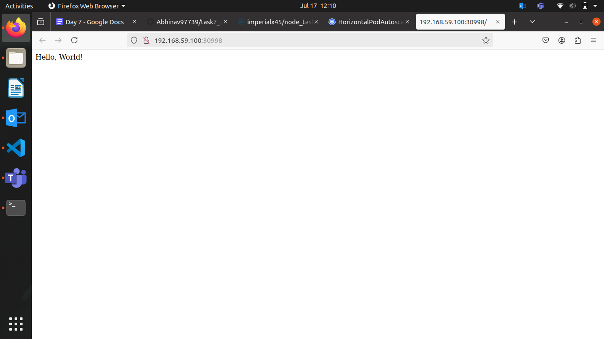

## Project 02

- Deploy a Node.js application to Kubernetes with advanced usage of ConfigMaps and Secrets. Implement Horizontal Pod Autoscaler (HPA) with both scale-up and scale-down policies. The project will include a multi-environment configuration strategy, integrating a Redis cache, and monitoring application metrics.

> Initialize a Git Repository
Create a new directory for your project and initialize Git:
```bash
mkdir nodejs-advanced-k8s-project
cd nodejs-advanced-k8s-project
git init
```
> Create Initial Files

Create the initial Node.js application and Docker-related files:
```bash
npm init -y
npm install express redis body-parser
```

Create app.js
```js
const express = require('express');
const bodyParser = require('body-parser');
const redis = require('redis');
const app = express();
const PORT = process.env.PORT || 3000;
```
> Connect to Redis
```
const redisClient = redis.createClient({
  url: `redis://${process.env.REDIS_HOST}:${process.env.REDIS_PORT}`
});
redisClient.on('error', (err) => console.error('Redis Client Error', err));

app.use(bodyParser.json());

app.get('/', async (req, res) => {
  const visits = await redisClient.get('visits');
  if (visits) {
    await redisClient.set('visits', parseInt(visits) + 1);
  } else {
    await redisClient.set('visits', 1);
  }
  res.send(`Hello, World! You are visitor number ${visits || 1}`);
});

app.listen(PORT, () => {
  console.log(`Server is running on port ${PORT}`);
});
```
> Create Dockerfile
```Dockerfile
FROM node:18

WORKDIR /usr/src/app

COPY package*.json ./

RUN npm install

COPY . .

EXPOSE 3000

CMD ["npm", "start"]
```

Create .dockerignore and paste the text
```
node_modules
.npm
```

>Build and push Docker image:
```bash
   docker build -t your-dockerhub-username/nodejs-advanced-app:latest .
   docker push your-dockerhub-username/nodejs-advanced-app:latest
```
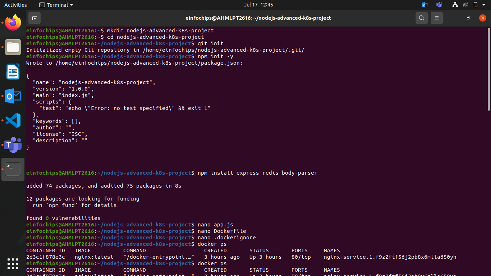
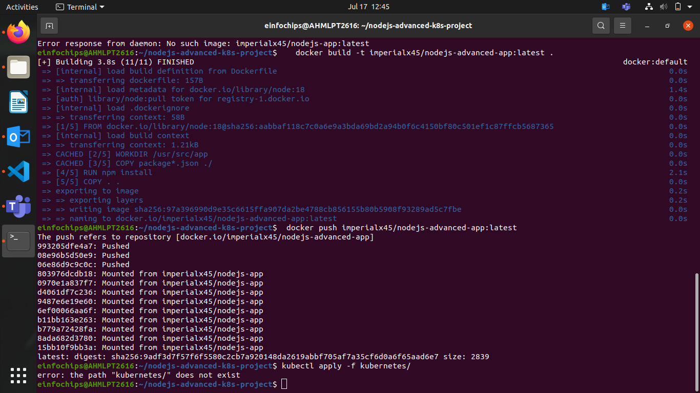
> Apply Kubernetes configurations:
```bash
kubectl apply -f kubernetes/
```

> Access the application:
```bash
minikube service nodejs-advanced-app-service --url
```

## Advanced Kubernetes Configuration

> Deployment Configuration

- Create `kubernetes/deployment.yaml` to deploy the Node.js application with Redis dependency:

```yaml
apiVersion: apps/v1
kind: Deployment
metadata:
  name: nodejs-advanced-app-deployment
spec:
  replicas: 2
  selector:
    matchLabels:
      app: nodejs-advanced-app
  template:
    metadata:
      labels:
        app: nodejs-advanced-app
    spec:
      containers:
      - name: nodejs-advanced-app
        image: your-dockerhub-username/nodejs-advanced-app:latest
        ports:
        - containerPort: 3000
        env:
        - name: PORT
          valueFrom:
            configMapKeyRef:
              name: app-config
              key: PORT
        - name: REDIS_HOST
          valueFrom:
            configMapKeyRef:
              name: redis-config
              key: REDIS_HOST
        - name: REDIS_PORT
          valueFrom:
            configMapKeyRef:
              name: redis-config
              key: REDIS_PORT
        - name: NODE_ENV
          valueFrom:
            secretKeyRef:
              name: app-secrets
              key: NODE_ENV
      - name: redis
        image: redis:latest
        ports:
        - containerPort: 6379
```

- ConfigMap for Application and Redis

Create kubernetes/configmap.yaml to manage application and Redis configurations:
```yaml
apiVersion: v1
kind: ConfigMap
metadata:
  name: app-config
data:
  PORT: "3000"

---
apiVersion: v1
kind: ConfigMap
metadata:
  name: redis-config
data:
  REDIS_HOST: "redis"
  REDIS_PORT: "6379"
```

> Secret for Sensitive Data
- Create kubernetes/secret.yaml to manage sensitive environment variables:
```bash
apiVersion: v1
kind: Secret
metadata:
  name: app-secrets
type: Opaque
data:
  NODE_ENV: cHJvZHVjdGlvbg== # Base64 encoded value for "production"
```

> Service Configuration
- Create kubernetes/service.yaml to expose the Node.js application:
```yaml
apiVersion: v1
kind: Service
metadata:
  name: nodejs-advanced-app-service
spec:
  selector:
    app: nodejs-advanced-app
  ports:
  - protocol: TCP
    port: 80
    targetPort: 3000
  type: LoadBalancer
```

> Horizontal Pod Autoscaler with Scale-Up and Scale-Down Policies
- Create kubernetes/hpa.yaml to manage autoscaling:
```bash
apiVersion: autoscaling/v2beta2
kind: HorizontalPodAutoscaler
metadata:
  name: nodejs-advanced-app-hpa
spec:
  scaleTargetRef:
    apiVersion: apps/v1
    kind: Deployment
    name: nodejs-advanced-app-deployment
  minReplicas: 2
  maxReplicas: 5
  metrics:
  - type: Resource
    resource:
      name: cpu
      target:
        type: Utilization
        averageUtilization: 50
  - type: Resource
    resource:
      name: memory
      target:
        type: Utilization
        averageUtilization: 70
  behavior:
    scaleUp:
      stabilizationWindowSeconds: 30
      selectPolicy: Max
      policies:
      - type: Pods
        value: 2
        periodSeconds: 30
      - type: Resource
        resource: cpu
        value: 2
        periodSeconds: 30
    scaleDown:
      stabilizationWindowSeconds: 30
      selectPolicy: Min
      policies:
      - type: Pods
        value: 1
        periodSeconds: 30
      - type: Resource
        resource: memory
        value: 1
        periodSeconds: 30
```

> Vertical Pod Autoscaler Configuration
- Create kubernetes/vpa.yaml to manage vertical scaling:
```bash
apiVersion: autoscaling.k8s.io/v1beta2
kind: VerticalPodAutoscaler
metadata:
  name: nodejs-advanced-app-vpa
spec:
  targetRef:
    apiVersion: apps/v1
    kind: Deployment
    name: nodejs-advanced-app-deployment
  updatePolicy:
    updateMode: "Auto"
```

> Redis Deployment
- Add a Redis deployment configuration to kubernetes/redis-deployment.yaml:
```yaml
apiVersion: apps/v1
kind: Deployment
metadata:
  name: redis-deployment
spec:
  replicas: 1
  selector:
    matchLabels:
      app: redis
  template:
    metadata:
      labels:
        app: redis
    spec:
      containers:
      - name: redis
        image: redis:latest
        ports:
        - containerPort: 6379
```

> Add Redis service configuration to kubernetes/redis-service.yaml:
```yaml
apiVersion: v1
kind: Service
metadata:
  name: redis-service
spec:
  selector:
    app: redis
  ports:
  - protocol: TCP
    port: 6379
    targetPort: 6379
  type: ClusterIP
```

> Apply Kubernetes Configurations
- Apply all configurations to your Minikube cluster:
```bash
kubectl apply -f kubernetes/redis-deployment.yaml
kubectl apply -f kubernetes/redis-service.yaml
kubectl apply -f kubernetes/configmap.yaml
kubectl apply -f kubernetes/secret.yaml
kubectl apply -f kubernetes/deployment.yaml
kubectl apply -f kubernetes/service.yaml
kubectl apply -f kubernetes/hpa.yaml
kubectl apply -f kubernetes/vpa.yaml
```
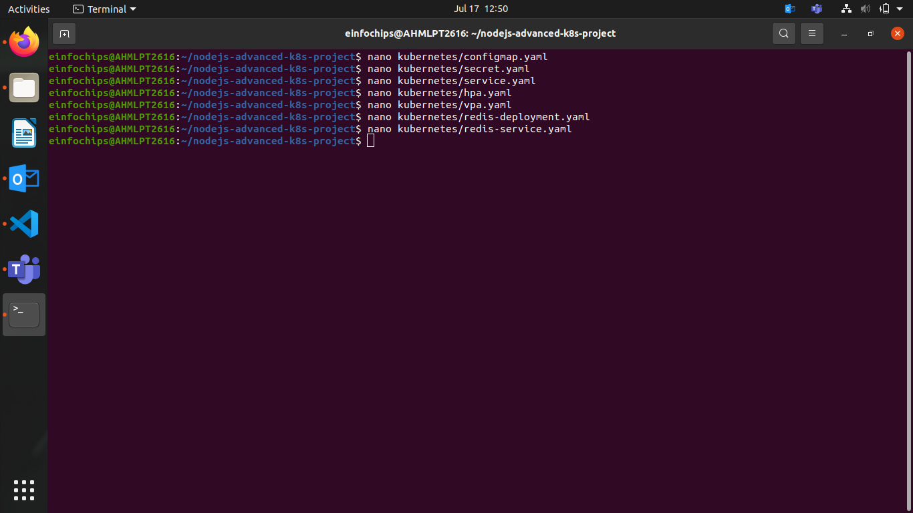
## Verify Deployments and Services
> Check the status of your deployments and services:
```bash
kubectl get all
```

> Access the application via Minikube:
```bash
minikube service nodejs-advanced-app-service --url
```
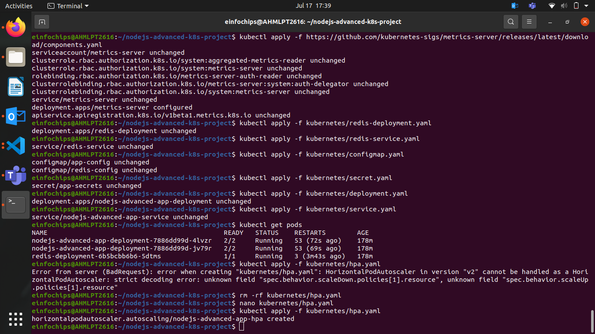
> Testing Scaling
## Simulate load on the application to test the HPA:
```bash
kubectl run -i --tty --rm load-generator --image=busybox --restart=Never -- /bin/sh
# Inside the pod, run the following command to generate load
while true; do wget -q -O- http://nodejs-advanced-app-service; done
```
> Validate Autoscaling Behavior
- Observe the HPA behavior:
```bash
kubectl get hpa
```
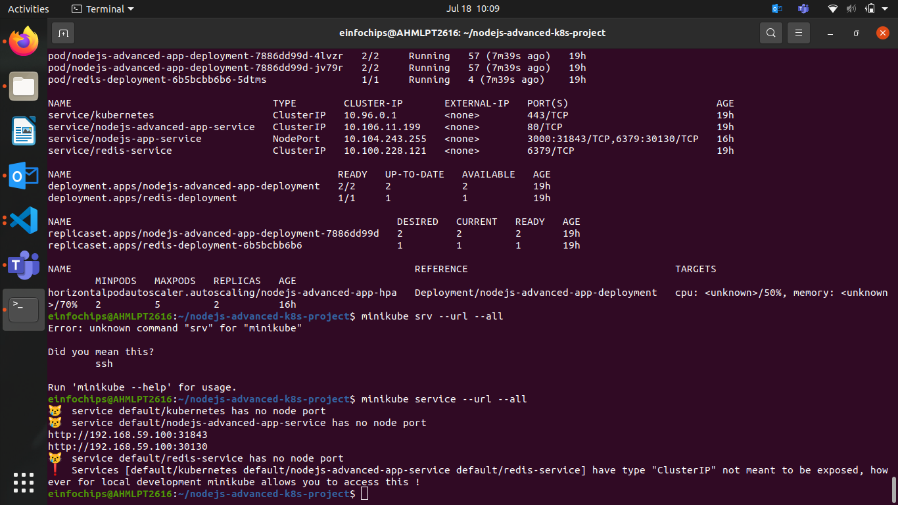
Watch the scaling events and verify that the application scales up and down based on the policies you configured.
3. Project Wrap-Up
3.1 Review and Clean Up
After completing the project, review the configurations and clean up the Minikube environment if needed:

minikube delete
